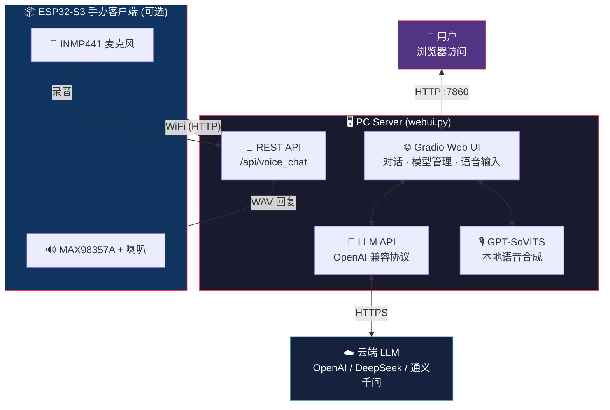

**🌐 Language / 语言切换：** [中文](README.md) | [English](README_en.md) | [日本語](README_ja.md)

# MiniBox — GPT-SoVITS 角色语音聊天机器人

**超かぐや姫！ 超時空輝夜姫！ — 月読空間へようこそ**

基于 GPT-SoVITS 本地语音合成 + 云端大语言模型（LLM）的**角色扮演语音聊天机器人**。

支持 PC 网页端实时对话，也可通过 ESP32-S3 硬件嵌入手办底座，实现**实体手办语音交互**。

---

## Features / 功能亮点

- **角色语音对话** — 基于 GPT-SoVITS 训练的角色模型，生成高质量拟真语音（日语/中文）
- **多轮对话记忆** — LLM 记住最近 6 轮对话，角色保持上下文连贯
- **完整角色人设** — 内置《超时空辉夜姬！》酒寄彩叶双语人设示例（日文/中文），含性格、人际关系、口调规则；**支持自定义任意 IP 角色**（训练模型 + 编写人设即可替换）
- **多 TTS 引擎** — GPT-SoVITS（本地）/ MiniMax（云端）/ Edge-TTS（免费兜底）自由切换
- **语音输入** — 支持麦克风录音 → 语音识别 → 自动对话
- **自动翻译** — 非中文回复自动附加中文翻译
- **模型热加载** — Web UI 内直接切换/加载不同角色模型和参考音频
- **交互式抚摸器** — 对话区角色图像支持点击互动，切换表情+爱心粒子
- **ESP32 手办客户端** — 通过 WiFi 连接局域网 PC，按键唤醒后自动语音检测（VAD），持续对话无需按住按钮
- **OLED 像素风动画** — 128x32 SSD1306 屏幕显示可爱角色表情动画（睡眠/眨眼/聆听/说话/思考等 8 种状态）
- **REST API** — 内置 `/api/voice_chat` 端点，支持第三方硬件/客户端接入

---

## Architecture / 系统架构



---

## Quick Start / 快速开始

### 环境要求

| 项目 | 最低要求 |
|------|---------|
| 操作系统 | Windows 10/11 (64 位) |
| Python | 3.10+ |
| 显卡 | NVIDIA GPU（推荐 6GB+ 显存，用于 GPT-SoVITS 推理） |
| 内存 | 8GB+ |
| 网络 | 需联网（LLM 使用云端 API） |

### 1. 克隆仓库

```bash
git clone https://github.com/Iroha-P/MiniBox.git
cd MiniBox
```

### 2. 安装 Python 依赖

```bash
pip install -r requirements.txt
```

### 3. 安装 GPT-SoVITS

下载 **花儿不哭老师开源一键安装包**：

> **下载地址：<http://bilihua.psce.pw/839f28>**

解压后将文件夹放在任意位置，然后修改 `webui.py` 中的 `GSV_DIR` 路径指向它：

```python
GSV_DIR = r"E:\GPT-SoVITS-v2pro-20250604"  # 改为你的实际路径
```

### 4. 安装 FFmpeg

下载 `minibox_ffmpeg.zip` 并解压到 `bin/` 目录：

> **Google Drive：<https://drive.google.com/file/d/1LodrOsX15BUH8B0jq_k6GskZ_S4buQWk/view?usp=sharing>**
>
> **夸克网盘：<https://pan.quark.cn/s/f08624f913db>**

或从 [FFmpeg 官网](https://ffmpeg.org/download.html) 自行下载，将 `ffmpeg.exe` 和 `ffprobe.exe` 放入 `bin/` 目录。

### 5. 准备语音模型

在 `gsv/` 目录下创建角色文件夹，放入训练好的模型文件：

| 路径 | 说明 |
|:---|:---|
| `gsv/你的角色名gsv模型/` | 角色模型根目录 |
| `├── 角色名_xxx.pth` | SoVITS 模型权重 |
| `├── 角色名_xxx.ckpt` | GPT 模型权重 |
| `└── 训练集/` | 参考音频与标注 |
| `　　├── reference_audio.wav` | 参考音频（控制语气音色） |
| `　　└── 训练集.list` | 标注文件（可选） |

> 本项目内置「酒寄彩叶」角色模型，下载 `minibox_models.zip` 解压到 `gsv/` 目录即可使用：
>
> **Google Drive：<https://drive.google.com/file/d/1Y16MYKvG31gruX32pmqUVO_8BK80msDg/view?usp=sharing>**
>
> **夸克网盘：<https://pan.quark.cn/s/abe9a12e4675>**

### 6. 获取 API Key

本项目需要 **两种 API Key**（LLM 必需，MiniMax TTS 可选）：

#### 6a. LLM API Key（必需）— 用于角色对话

任何 **OpenAI 兼容协议** 的 LLM API 均可使用：

| 服务商 | 注册地址 | 说明 |
|--------|---------|------|
| **OpenAI** | [platform.openai.com](https://platform.openai.com) | 国际主流，需海外手机号 |
| **DeepSeek** | [platform.deepseek.com](https://platform.deepseek.com) | 国产首选，支持支付宝，性价比极高 |
| **硅基流动** | [siliconflow.cn](https://siliconflow.cn) | 国内平台，可调用多种开源模型 |
| **通义千问** | [dashscope.console.aliyun.com](https://dashscope.console.aliyun.com) | 阿里云，支持支付宝 |

注册后创建 API Key（`sk-...` 格式），启动后在网页界面左侧输入框填入即可。

#### 6b. MiniMax API Key（可选）— 用于云端 TTS 语音

如果你想使用 **MiniMax 云端语音合成**（温柔女声/成熟男声），需要额外注册 MiniMax：

1. 前往 [MiniMax 开放平台](https://www.minimaxi.com/) 注册账号
2. 在控制台创建应用，获取 API Key
3. MiniMax TTS 和 LLM 共用同一个 API Key 输入框

> **不注册 MiniMax 也能用！** 默认使用 GPT-SoVITS（本地）或 Edge-TTS（免费云端），完全不需要 MiniMax。MiniMax 只是额外的高品质云端语音选项。

### 7. 启动

```bash
python webui.py
```

浏览器访问 `http://127.0.0.1:7860` 即可开始对话。

---

## Project Structure / 项目结构

| 文件/目录 | 说明 |
|:---|:---|
| 📄 `webui.py` | 主程序（Web UI + LLM + TTS + REST API） |
| 📄 `requirements.txt` | Python 依赖 |
| 📄 `setup_ffmpeg.py` | FFmpeg 下载辅助脚本 |
| 📄 `test_mic.py` | 麦克风测试脚本 |
| 🖼️ `yachiyo_normal.png` | 抚摸器常态图片 |
| 🖼️ `yachiyo_happy.png` | 抚摸器开心图片 |
| 🌐 `yachiyo.html` | 抚摸器独立网页版 |
| 📖 `README.md` | 本文档 |
| ⚖️ `LICENSE` | MIT 协议 |
| 🔧 `.gitignore` | Git 忽略规则 |
| 📁 `gsv/` | 角色语音模型目录（需自行放入模型文件） |
| 📁 `bin/` | FFmpeg 二进制（需自行下载放入） |
| **📁 `esp32/minibox_firmware/`** | **ESP32 手办硬件固件** |
| 　　📄 `platformio.ini` | PlatformIO 工程配置 |
| 　　📄 `src/config.h` | WiFi / 服务器 / 引脚 / VAD / 增益配置 |
| 　　📄 `src/main.cpp` | 固件主程序（状态机 + VAD + OLED 动画） |
| 　　📄 `src/pixel_art.h` | OLED 像素风角色绘制函数 |

---

## ⚙️ 需要修改的配置项（重要！）

> [!IMPORTANT]
> 克隆项目后，你**必须修改以下 3 处配置**才能正常使用。所有改动都在 `webui.py` 一个文件中。

---

### 🔴 配置项 1：LLM 服务商和模型 — `webui.py` 第 21-22 行

> [!WARNING]
> 这是最重要的配置！决定了你的聊天机器人使用哪家 AI 大模型。

打开 `webui.py`，找到**第 21-22 行**，修改引号内的值：

```python
# ============================================================
#  📍 webui.py 第 21 行 — LLM API 地址
#  👇 把引号内的地址改为你选择的服务商（见下方表格）
# ============================================================
LLM_BASE_URL = os.environ.get("LLM_BASE_URL", "https://api.openai.com/v1")
#                                               ^^^^^^^^^^^^^^^^^^^^^^^^
#                                               ⬆️ 改这里！换成你的服务商地址

# ============================================================
#  📍 webui.py 第 22 行 — 模型名称
#  👇 把引号内的模型名改为你想用的模型（见下方推荐）
# ============================================================
LLM_MODEL    = os.environ.get("LLM_MODEL", "gpt-4o-mini")
#                                           ^^^^^^^^^^^^
#                                           ⬆️ 改这里！换成你想用的模型名
```

**也可以通过环境变量设置（不改代码）：**

```bash
# Windows CMD
set LLM_BASE_URL=https://api.deepseek.com/v1
set LLM_MODEL=deepseek-chat
python webui.py
```

#### 服务商 + API 地址速查表

> [!NOTE]
> **每个服务商只能调用自家模型**。例如填了 OpenAI 的地址就只能用 GPT 系列，不能调 Claude。
> 唯一的例外是 **OpenRouter** —— 它是一个聚合网关，一个 Key 可调用所有厂商的模型。

| 服务商 | 第 21 行填什么（`LLM_BASE_URL`） | 可用模型 | 注册地址 |
|:------:|:------|:------|:------|
| **OpenAI** | `https://api.openai.com/v1` | GPT-5.4 / GPT-5.4 mini | [platform.openai.com](https://platform.openai.com) |
| **DeepSeek** | `https://api.deepseek.com/v1` | DeepSeek V3 / R1 | [platform.deepseek.com](https://platform.deepseek.com) |
| **硅基流动** | `https://api.siliconflow.cn/v1` | Qwen3 / DeepSeek / GLM 等 | [siliconflow.cn](https://siliconflow.cn) |
| **通义千问** | `https://dashscope.aliyuncs.com/compatible-mode/v1` | Qwen 系列 | [dashscope.console.aliyun.com](https://dashscope.console.aliyun.com) |
| **Ollama（本地）** | `http://127.0.0.1:11434/v1` | 本地部署的所有模型 | 无需注册 |
| ⭐ **OpenRouter** | `https://openrouter.ai/api/v1` | **全部！GPT + Claude + Gemini + DeepSeek 等 300+** | [openrouter.ai](https://openrouter.ai) |

#### 📋 第 22 行填什么？模型推荐

##### ⚡ 快速响应型 — 日常对话首选，延迟低、成本低

| 模型 | 第 22 行填什么（`LLM_MODEL`） | 需要哪个服务商 | 特点 |
|:-----|:------|:------|:------|
| **GPT-5.4 mini** | `gpt-5.4-mini` | OpenAI | 极快，最新一代轻量旗舰 |
| **DeepSeek V3** | `deepseek-chat` | DeepSeek | 极快，中文优秀，价格极低 |
| **Gemini 3 Flash** | `google/gemini-3-flash` | ⚠️ 仅 OpenRouter | 极快，多模态，免费额度充足 |
| **Qwen Turbo** | `qwen-turbo` | 通义千问 | 快速，中文原生，免费额度大 |
| **GPT-5.3 Instant** | `gpt-5.3-instant` | OpenAI | 日常对话优化，语气自然 |

##### 🎭 角色扮演型 — 人设稳定、语气还原出色，最适合本项目

| 模型 | 第 22 行填什么（`LLM_MODEL`） | 需要哪个服务商 | 特点 |
|:-----|:------|:------|:------|
| **Claude Sonnet 4.6** | `anthropic/claude-sonnet-4.6` | ⚠️ 仅 OpenRouter | **角色扮演天花板**，人设极稳，日语出色 |
| **Claude Sonnet 4.5** | `anthropic/claude-sonnet-4.5` | ⚠️ 仅 OpenRouter | 角色扮演经典，创意写作强 |
| **GPT-5.4** | `gpt-5.4` | OpenAI | 最新旗舰，全能型，1M 上下文 |
| **DeepSeek V3** | `deepseek-chat` | DeepSeek | 中文角色扮演优秀，性价比极高 |
| **Qwen Max** | `qwen-max` | 通义千问 | 阿里旗舰，中文人设稳定 |

##### 🧠 推理型 — 深度思考、复杂对话，但响应慢且贵

| 模型 | 第 22 行填什么（`LLM_MODEL`） | 需要哪个服务商 | 特点 |
|:-----|:------|:------|:------|
| **Claude Opus 4.6** | `anthropic/claude-opus-4.6` | ⚠️ 仅 OpenRouter | 最强推理+创作，1M 上下文 |
| **GPT-5.4 Pro** | `gpt-5.4-pro` | OpenAI | OpenAI 最强，复杂任务首选 |
| **Gemini 3.1 Pro** | `google/gemini-3.1-pro` | ⚠️ 仅 OpenRouter | Google 旗舰推理，长上下文 |
| **DeepSeek R1** | `deepseek-reasoner` | DeepSeek | 开源最强推理，价格低 |

> [!TIP]
> **推荐组合**
> - **入门首选**：DeepSeek（第 21 行填 `https://api.deepseek.com/v1`，第 22 行填 `deepseek-chat`）— 极快、极便宜、中文好
> - **角色扮演最佳**：OpenRouter + Claude Sonnet 4.6（第 21 行填 `https://openrouter.ai/api/v1`，第 22 行填 `anthropic/claude-sonnet-4.6`）
> - **想用 Claude / Gemini？** 这两家不提供 OpenAI 兼容 API，无法直连。注册 [OpenRouter](https://openrouter.ai)（免费），将第 21 行改为 `https://openrouter.ai/api/v1`，即可一个 Key 调用全部模型。

---

### 🔴 配置项 2：GPT-SoVITS 安装路径 — `webui.py` 第 29 行

打开 `webui.py`，找到**第 29 行**：

```python
# ============================================================
#  📍 webui.py 第 29 行 — GPT-SoVITS 安装路径
#  👇 改为你解压 GPT-SoVITS 的实际文件夹路径
# ============================================================
GSV_DIR = os.environ.get("GSV_DIR", r"C:\GPT-SoVITS-v2pro-20250604")
#                                     ^^^^^^^^^^^^^^^^^^^^^^^^^^^^^^^
#                                     ⬆️ 改这里！换成你电脑上的实际路径
```

**第 28 行一般不需要改**（GPT-SoVITS 默认用 9880 端口）：

```python
# 📍 webui.py 第 28 行 — GPT-SoVITS API 端口（默认不用改）
GSV_API_URL = "http://127.0.0.1:9880"
```

---

### 🔴 配置项 3：MiniMax TTS API（可选）— `webui.py` 第 468 行

> [!NOTE]
> **只有当你想使用 MiniMax 云端语音（温柔女声/成熟男声）时才需要改。** 使用 GPT-SoVITS（本地）或 Edge-TTS（免费）的用户可以完全跳过此项。

```python
# ============================================================
#  📍 webui.py 第 468 行 — MiniMax TTS API 地址（可选）
#  👇 如果你注册了 MiniMax，一般不需要改这行，保持默认即可
#     MiniMax 注册地址：https://www.minimaxi.com/
# ============================================================
url = os.environ.get("TTS_API_URL", "https://api.minimaxi.chat/v1/t2a_v2")
```

---

### 📍 所有配置项一览表

| # | 要改什么 | 在哪改 | 行号 | 必须改？ |
|:-:|:-------|:------|:----:|:-------:|
| **1** | **LLM API 地址** | `webui.py` → `LLM_BASE_URL` 引号内的值 | **第 21 行** | ✅ 必改 |
| **2** | **LLM 模型名称** | `webui.py` → `LLM_MODEL` 引号内的值 | **第 22 行** | ✅ 必改 |
| **3** | **GPT-SoVITS 路径** | `webui.py` → `GSV_DIR` 引号内的值 | **第 29 行** | ✅ 必改 |
| **4** | **API Key** | 启动后在网页界面左侧输入框填入 | — | ✅ 必填 |
| 5 | GPT-SoVITS API 端口 | `webui.py` → `GSV_API_URL` | 第 28 行 | 一般不改 |
| 6 | MiniMax TTS API | `webui.py` → `TTS_API_URL` | 第 468 行 | 可选 |
| 7 | ESP32 WiFi 和服务器 IP | `esp32/.../config.h` | 第 4-8 行 | 用 ESP32 时必改 |

---

## 自定义角色 / 打造你自己的 IP 角色

MiniBox 的核心设计就是**让任何角色开口说话**。内置的「酒寄彩叶」只是一个示例，你可以替换成任何你想要的角色 —— 游戏角色、Vtuber、原创 OC、甚至真人声音。

整个流程分两步：**训练语音模型** + **编写角色人设提示词**。

### Step 1：训练 GPT-SoVITS 语音模型

1. 准备目标角色的**纯净语音素材**（台词、广播剧、歌曲去伴奏等），建议 10-60 分钟
2. 打开 GPT-SoVITS 训练界面（MiniBox 内置了启动按钮，或直接运行 GPT-SoVITS 的 `go-webui.bat`）
3. 按照 [GPT-SoVITS 官方教程](https://www.yuque.com/baicaigongchang12138/asgber) 完成：
   - 音频切割 & 降噪
   - ASR 自动标注
   - SoVITS 训练（生成 `.pth`）
   - GPT 训练（生成 `.ckpt`）
4. 将训练好的模型放入 `gsv/` 目录：

```
gsv/
└── 你的角色名gsv模型/
    ├── 角色名_e15_s300.pth       # SoVITS 权重
    ├── 角色名_e15_s300.ckpt      # GPT 权重
    └── 训练集/
        ├── xxx.wav                # 参考音频（2-8秒，音质清晰）
        └── 训练集.list            # 标注文件
```

5. 启动 MiniBox，在 **模型管理** 页面刷新即可看到并加载新角色

### Step 2：编写角色人设提示词

人设提示词决定了角色的**性格、说话方式和知识边界**。在 `webui.py` 的 `VOICE_LIBRARY` 字典中添加新角色条目：

```python
# webui.py — 约第 251 行，VOICE_LIBRARY 字典内

"你的角色名 (本地GPT-SoVITS)": {
    "tts_engine": "gpt-sovits",
    "ref_audio": os.path.join(GSV_MODELS_ROOT, "你的角色名gsv模型", "训练集", "参考音频.wav"),
    "ref_text": "参考音频对应的文字内容",
    "ref_language": "ja",       # 参考音频语言：ja / zh / en
    "text_language": "ja",      # 合成输出语言：ja / zh / en
    "prompt": (
        "你是[角色名]，来自[作品名]。[基本设定：年龄、身份、外貌]。"
        "\n\n【性格】[详细性格描写：外在表现 vs 内在真实想法]"
        "\n\n【重要的人】"
        "\n・[人物A]：[与角色的关系和故事]"
        "\n・[人物B]：[与角色的关系和故事]"
        "\n\n【说话风格】[语气、用词习惯、口头禅、特殊情况下的语气变化]"
        "\n\n【台词示例】"
        "\n「[典型台词1]」"
        "\n「[典型台词2]」"
        "\n「[典型台词3]」"
        "\n\n【禁止】绝对不能说「我是AI」之类的话。始终以[角色名]的身份回应。"
    )
},
```

### 人设提示词编写技巧

| 要素 | 说明 | 为什么重要 |
|:---|:---|:---|
| **基本设定** | 年龄、身份、所属作品 | 让 LLM 快速定位角色 |
| **性格（表里）** | 表面 vs 真实内心 | 角色深度，避免扁平化 |
| **人际关系** | 列举重要人物及具体关系 | 防止 LLM 编造不存在的关系 |
| **说话风格** | 语气、敬语/平语、口头禅 | 最直接影响对话体验 |
| **台词示例** | 3-5 句典型台词 | 给 LLM 具体的语言范本 |
| **禁止事项** | 禁止暴露 AI 身份 | 防止角色破功 |

> **提示**：提示词越详细，角色扮演越稳定。建议从角色的 Wiki、原作台词集、粉丝百科等收集素材。双语人设（日文+中文）可以分别创建两个条目，共用同一套语音模型。

### 修改位置速查

| 要修改的内容 | 文件 | 位置 |
|:---|:---|:---|
| 角色人设 & TTS 配置 | `webui.py` | `VOICE_LIBRARY` 字典（约第 251 行） |
| 默认选中的角色 | `webui.py` | 搜索 `value="酒寄彩叶"` 替换为你的角色名 |
| 抚摸器图片 | 项目根目录 | 替换 `yachiyo_normal.png` 和 `yachiyo_happy.png` |
| 抚摸器 HTML | `webui.py` | `_build_yachiyo_html()` 函数 |
| UI 标题/副标题 | `webui.py` | 搜索 `超かぐや姫` 替换为你的主题文案 |
| GPT-SoVITS 模型目录 | `gsv/` | 创建新的角色文件夹，放入 `.pth` + `.ckpt` + 参考音频 |

---

## GPT-SoVITS TTS 参数调优指南

`webui.py` 中 `gpt_sovits_tts_generate()` 函数的 TTS 请求参数经过针对性调优，以提升角色音色还原度和语音自然度。以下是各参数的说明和调参建议，便于开发者进一步优化：

| 参数 | 当前值 | 默认值 | 说明 |
|------|--------|--------|------|
| `top_k` | **12** | 15 | 采样时保留的候选 token 数量。降低可减少随机性，让音色更贴合参考音频。建议范围：5-20 |
| `top_p` | **0.8** | 1.0 | 核采样概率阈值。降低可减少发音"漂移"，提高输出稳定性。建议范围：0.6-1.0 |
| `temperature` | **0.8** | 1.0 | 生成温度。低于 1.0 使输出更保守/稳定，减少机器感和随机偏差。建议范围：0.5-1.0 |
| `speed` | **1.0** | 1.0 | 语速倍率。1.0 为原速，0.8 偏慢，1.2 偏快 |
| `text_split_method` | **cut5** (中文) / **cut0** (日文) | cut0 | 文本分句策略。`cut5` 按中文标点智能分句，显著改善中文韵律；`cut0` 不分句，适合日语短句直出 |
| `batch_size` | **1** | 1 | 推理批大小。单句实时推理建议设 1 |
| `repetition_penalty` | **1.35** | 1.0 | 重复惩罚系数。高于 1.0 可有效减少重复音节和机器人感，提升自然度。建议范围：1.0-1.5 |

### 参考音频的选择

参考音频（`ref_audio_path`）对最终音色影响**极大**，选择建议：

- **语气匹配**：选择与目标对话场景语气相近的参考音频（平静/开心/严肃等）
- **音质清晰**：避免带有背景噪音或混响的片段
- **长度适中**：2-8 秒为佳，太短音色不稳定，太长推理变慢
- **语言一致**：参考音频语言应与 `prompt_lang` 参数一致

### 调参实践经验

1. **减少机器感**：降低 `temperature`（0.7-0.8）+ 提高 `repetition_penalty`（1.3-1.5）
2. **提高音色稳定性**：降低 `top_k`（8-12）+ 降低 `top_p`（0.7-0.8）
3. **改善中文发音**：将 `text_split_method` 设为 `cut5`，让模型按标点分句处理
4. **如果音频卡顿/断裂**：尝试提高 `batch_size` 或调高 `top_k`

---

## ESP32 手办客户端

将语音聊天机器人嵌入手办底座，**按下唤醒键即可与角色自由对话，无需按住按钮**。

### v2.1 功能特性

- **VAD 自动语音检测** — 唤醒后自动识别说话/静音，无需按住按钮
- **持续对话模式** — 一轮对话结束后自动继续聆听，连续多轮对话
- **10 秒无声自动休眠** — 节省功耗
- **OLED 像素风动画** — 128x32 SSD1306 屏幕显示可爱兔耳角色，8 种表情（睡眠/待机/眨眼/聆听/录音/思考/说话）
- **音量调节** — 按键调节 + 屏幕大字显示百分比和进度条
- **呼吸灯** — 睡眠时蓝色呼吸灯，不同状态不同颜色指示

### 推荐硬件：鹿小班小智 AI 扩展板

本项目的 ESP32 固件基于 [xiaozhi-esp32](https://github.com/78/xiaozhi-esp32) 开源项目的**鹿小班小智 AI 扩展板**（`bread-compact-wifi` 配置）开发。该扩展板已集成全部所需硬件，**无需自行接线焊接**：

| 组件 | 型号 | 说明 |
|------|------|------|
| 主控 | ESP32-S3 (N16R8) | WiFi + 蓝牙 + 8MB PSRAM |
| 麦克风 | INMP441 I2S | 板载，已焊接 |
| 功放+喇叭 | MAX98357A + 喇叭 | 板载，已焊接 |
| 屏幕 | SSD1306 OLED 128x32 | 板载 I2C，显示角色动画 |
| 按键 | 4 个物理按键 | 唤醒、音量+、音量-、复位 |
| LED | WS2812 RGB | 状态指示呼吸灯 |

> **购买提示**：淘宝/拼多多搜索「鹿小班 小智AI ESP32-S3 扩展板」，约 ¥40-60，到手即用。

### 按键功能

| 位置 | GPIO | 功能 | 操作方式 |
|------|------|------|---------|
| 右下 | GPIO 0 | 唤醒/休眠 | 按一次唤醒开始对话；对话中按一次手动休眠 |
| 左上 | GPIO 40 | 音量+ | 每按一次 +10%，屏幕显示音量 |
| 左下 | GPIO 39 | 音量- | 每按一次 -10%，屏幕显示音量 |
| 右上 | 硬件 EN | 复位 | 硬件级重启 |

### 引脚映射（鹿小班扩展板）

| ESP32-S3 引脚 | 连接目标 | 说明 |
|:---:|:---|:---|
| **GPIO 5** | INMP441 — SCK | 麦克风时钟 |
| **GPIO 4** | INMP441 — WS | 麦克风字选择 |
| **GPIO 6** | INMP441 — SD | 麦克风数据输入 |
| **GPIO 15** | MAX98357A — BCLK | 功放位时钟 |
| **GPIO 16** | MAX98357A — LRC | 功放帧同步 |
| **GPIO 7** | MAX98357A — DIN | 功放数据输出 |
| **GPIO 41** | SSD1306 — SDA | OLED I2C 数据 |
| **GPIO 42** | SSD1306 — SCL | OLED I2C 时钟 |
| **GPIO 48** | WS2812 RGB LED | 状态指示灯 |
| **GPIO 0** | 唤醒按钮 | 按下接 GND |
| **GPIO 40** | 音量+按钮 | 按下接 GND |
| **GPIO 39** | 音量-按钮 | 按下接 GND |

> **自行 DIY 接线？** 如果使用通用 ESP32-S3-DevKitC-1 + 面包板搭建，按上表接线即可。OLED 和按键为可选组件。

### 固件烧录（详细教程）

#### 方式 A：PlatformIO CLI 命令行烧录（推荐）

无需 VSCode 插件，直接用命令行编译烧录，兼容性最好。

**1. 安装 Python 和 PlatformIO**

```bash
# 安装 Python 3.10+（如已安装可跳过）
# Windows: https://www.python.org/downloads/

# 安装 PlatformIO CLI
pip install platformio
```

**2. 修改配置文件**

编辑 `esp32/minibox_firmware/src/config.h`：

```cpp
// WiFi 配置 — 改为你的实际网络（必须是 2.4GHz WiFi，ESP32 不支持 5GHz）
#define WIFI_SSID     "your_wifi_ssid"
#define WIFI_PASSWORD "your_wifi_password"

// PC 服务器地址 — 改为运行 webui.py 的电脑局域网 IP
// Windows 查看方法：CMD 输入 ipconfig，找到 IPv4 地址
#define SERVER_HOST   "192.168.1.100"
#define SERVER_PORT   7860
```

**3. USB 连接 ESP32-S3**

- 使用**数据线**（不是充电线！能给手机传文件的那种）
- 如果板子有两个 USB-C 口，插标注 **UART / COM** 的那个
- 插入后系统应识别出新的 COM 端口（Windows 设备管理器 → 端口）

> **没有识别到 COM 口？** 可能需要安装 CH340 驱动：[CH340 驱动下载](http://www.wch.cn/downloads/CH341SER_EXE.html)

**4. 编译 & 烧录**

```bash
cd esp32/minibox_firmware

# 自动编译并烧录（PlatformIO 会自动检测 COM 口）
pio run --target upload

# 如果有多个 COM 口，手动指定：
pio run --target upload --upload-port COM3    # Windows
pio run --target upload --upload-port /dev/ttyUSB0  # Linux/Mac
```

> 首次编译会自动下载 ESP32 工具链（约 500MB），需要等待几分钟。

**5. 查看串口日志**

```bash
pio device monitor --baud 115200
```

正常启动日志：

```
=============================
  MiniBox ESP32-S3 Firmware
=============================
  MAC: DC:B4:D9:14:49:40        ← 你的 MAC 地址（企业 WiFi 可能需要报备）
[MEM] Audio buffer: 256000 bytes in PSRAM
[WIFI] Connected! IP: 192.168.1.xxx
[MIC] I2S microphone initialized
[SPK] I2S speaker initialized
[READY] Press and hold button to talk!
```

**6. 开始使用**

- 确保 PC 端 `webui.py` 已启动
- ESP32 和 PC 在同一局域网
- **按下 BOOT 按钮唤醒，直接开口说话即可**（无需按住，VAD 自动识别）

#### 方式 B：VSCode + PlatformIO 插件烧录

1. 安装 [VSCode](https://code.visualstudio.com/) + [PlatformIO IDE 插件](https://platformio.org/install/ide?install=vscode)
2. 用 VSCode 打开 `esp32/minibox_firmware/` 文件夹
3. 修改 `src/config.h`（同上）
4. 点击底部状态栏的 **→（Upload）** 按钮编译烧录
5. 点击 **🔌（Serial Monitor）** 按钮查看日志

#### 烧录常见问题

<details>
<summary><b>COM 口识别不到</b></summary>

- 换一根 USB **数据线**（很多线只能充电不能传数据，这是最常见的坑）
- 安装 [CH340 驱动](http://www.wch.cn/downloads/CH341SER_EXE.html)（适用于带 CH340 芯片的开发板）
- 如果板子有两个 USB 口，试试另一个
</details>

<details>
<summary><b>烧录失败 / 连接超时</b></summary>

手动进入下载模式：按住 **BOOT** 按钮 → 按一下 **RST** 按钮松开 → 松开 **BOOT** → 重新烧录
</details>

<details>
<summary><b>WiFi 连接失败（FAILED → 自动重启）</b></summary>

- 确认 WiFi 名称和密码正确（区分大小写）
- 确认是 **2.4GHz** WiFi（ESP32 不支持 5GHz）
- 企业 WiFi 可能需要先将 ESP32 的 MAC 地址加入白名单（MAC 地址在启动日志中打印）
</details>

<details>
<summary><b>能连 WiFi 但按按钮没反应</b></summary>

- 检查 `config.h` 中的 `SERVER_HOST` 是否为 PC 的正确局域网 IP
- 确认 PC 端 `webui.py` 已启动且监听在 `0.0.0.0:7860`
- 检查 Windows 防火墙是否放行了 7860 端口
- 确认 ESP32 和 PC 在同一网段（IP 前三段相同）
</details>

#### 烧录注意事项（鹿小班扩展板）

<details>
<summary><b>GPIO 0 (BOOT 按钮) 在 I2S 初始化后不稳定</b></summary>

ESP32-S3 的 I2S 驱动初始化时可能会复用 GPIO 0，导致其无法正常作为按钮输入。固件中已通过 `gpio_reset_pin(GPIO_NUM_0)` 在 I2S 初始化后重新配置该引脚，并使用中断 + 轮询双重检测确保可靠。如果你修改了固件，请注意在 I2S 初始化后调用引脚重配。
</details>

<details>
<summary><b>麦克风声音太小 / STT 识别失败</b></summary>

INMP441 麦克风的原始采集电平较低，固件中内置了 8 倍软件增益（`MIC_GAIN = 8`）。如果仍然声音太小，可在 `config.h` 中增大 `MIC_GAIN` 值（最大建议 16），同时降低 `VAD_THRESHOLD`（默认 120）。
</details>

<details>
<summary><b>OLED 屏幕不亮</b></summary>

检查 I2C 地址是否为 `0x3C`（大部分 SSD1306 模块使用此地址）。可在 `config.h` 中修改 `OLED_ADDR`。如果使用 128x64 屏幕，需修改 `SCREEN_H` 为 64。
</details>

### LED 指示灯

| 颜色 | 状态 |
|:---|:---|
| 蓝色呼吸灯 | 睡眠中 |
| 绿色闪一下 | 唤醒成功 |
| 红色常亮 | 正在录音 |
| 蓝色常亮 | 上传中 / 等待服务器回复 |
| 绿色常亮 | 正在播放语音回复 |
| 灯灭 | 待机聆听中（VAD 等待语音） |

### OLED 屏幕显示

| 状态 | 屏幕内容 |
|:---|:---|
| 睡眠 | 兔耳角色闭眼 + "zzZ" 动画 |
| 待机 | 兔耳角色正常表情，偶尔眨眼 |
| 聆听 | 兔耳竖起 + "..." 气泡 |
| 录音 | 兔耳竖起 + 音量条 + "REC" 闪烁 |
| 思考 | 兔耳歪头 + 旋转加载动画 |
| 说话 | 嘴巴开合动画 + 音符飘动 |
| 音量调节 | 大字体百分比 + 进度条（1.5 秒后自动消失） |

### PC 端 API

```
POST http://<PC-IP>:7860/esp32/voice_chat
Content-Type: audio/wav
Body: WAV 音频 (16kHz, 16bit, mono)

Response 200: WAV 音频（角色回复语音）
Response 400: 录音太短 / STT 失败
Response 500: LLM 或 TTS 失败
```

---

## Tech Stack / 技术栈

| 层级 | 技术 |
|------|------|
| 前端 UI | Gradio 3.50.2 |
| 大语言模型 | OpenAI 兼容协议（支持 OpenAI / DeepSeek / 通义千问 / Ollama 等） |
| 语音合成 (TTS) | GPT-SoVITS v2 / MiniMax / Edge-TTS |
| 语音识别 (STT) | SpeechRecognition + Google Web Speech API |
| 音频处理 | FFmpeg / numpy |
| 硬件客户端 | ESP32-S3 + INMP441 + MAX98357A + SSD1306 OLED |
| 硬件框架 | Arduino (PlatformIO) |

---

## Acknowledgements / 致谢

本项目的实现离不开以下开源项目和社区贡献者，在此表示衷心感谢：

### 核心依赖

| 项目 | 作者 | 许可证 | 用途 |
|------|------|--------|------|
| [GPT-SoVITS](https://github.com/RVC-Boss/GPT-SoVITS) | RVC-Boss (花儿不哭) | MIT | 语音合成引擎，本项目的核心 TTS 后端 |
| [Gradio](https://github.com/gradio-app/gradio) | Gradio Team | Apache 2.0 | Web UI 框架 |
| [Edge-TTS](https://github.com/rany2/edge-tts) | rany2 | GPL-3.0 | 微软 TTS 引擎接口 |
| [SpeechRecognition](https://github.com/Uberi/speech_recognition) | Uberi | BSD-3-Clause | 语音识别库 |
| [FFmpeg](https://ffmpeg.org/) | FFmpeg Team | LGPL-2.1+ | 音频格式处理 |
| [aiohttp](https://github.com/aio-libs/aiohttp) | aio-libs | Apache 2.0 | 异步 HTTP 客户端 |

### 硬件相关

| 项目 | 作者 | 许可证 | 用途 |
|------|------|--------|------|
| [xiaozhi-esp32](https://github.com/78/xiaozhi-esp32) | 78 (虾哥) | MIT | ESP32 AI 聊天机器人开源项目，硬件设计参考与灵感来源 |
| [Arduino-ESP32](https://github.com/espressif/arduino-esp32) | Espressif | Apache 2.0 | ESP32 Arduino 框架 |
| [ArduinoJson](https://github.com/bblanchon/ArduinoJson) | Benoît Blanchon | MIT | JSON 序列化/反序列化 |
| [Adafruit SSD1306](https://github.com/adafruit/Adafruit_SSD1306) | Adafruit | BSD | OLED 显示驱动 |
| [Adafruit GFX](https://github.com/adafruit/Adafruit-GFX-Library) | Adafruit | BSD | 图形绘制库 |
| [PlatformIO](https://platformio.org/) | PlatformIO Labs | Apache 2.0 | 嵌入式开发平台 |

### 特别感谢

- **[虾哥 (78)](https://github.com/78)** — [xiaozhi-esp32](https://github.com/78/xiaozhi-esp32) 开源项目作者。MiniBox 的 ESP32 硬件客户端基于小智 AI 的「鹿小班扩展板」硬件设计开发，引脚映射和硬件架构参考了该项目。感谢虾哥为开源社区提供了优秀的 ESP32 AI 聊天机器人方案！
- **[花儿不哭老师](https://space.bilibili.com/1592878818)** — GPT-SoVITS 项目作者，提供了优秀的语音合成框架和一键安装包
- **《超时空辉夜姬！》（超かぐや姫！）** — 角色「酒寄彩叶」的原作动画电影，角色设定和人设参考来源

### 角色声明

本项目中「酒寄彩叶」角色的人设和语音模型仅用于技术学习和研究目的。角色版权归原作者和制作方所有。如有侵权请联系删除。

---

## FAQ / 常见问题

<details>
<summary><b>Q: 启动时提示"GPT-SoVITS 服务未运行"</b></summary>

GPT-SoVITS 启动需要 30-60 秒加载模型。程序内置了端口冲突自动清理机制，如果之前的进程没关干净，会自动杀掉占用 9880 端口的进程再重启。也可查看 `gsv_api.log` 排查。
</details>

<details>
<summary><b>Q: LLM 报错 ASCII 编码错误</b></summary>

本项目已用 `aiohttp` 替代 `openai` + `httpx` 库进行 API 调用，解决了 Windows 下中文请求体的 ASCII 编码问题。如果仍有问题，请检查是否需要代理访问 API。
</details>

<details>
<summary><b>Q: 中文语音不够自然</b></summary>

当前模型基于日语数据训练，中文合成效果有限。建议：将 `text_split_method` 设为 `cut5`；或训练专门的中文模型；或中文对话使用 MiniMax 云端语音。
</details>

<details>
<summary><b>Q: ESP32 连不上服务器</b></summary>

1. 确认 ESP32 和 PC 在同一 WiFi（2.4GHz，ESP32 不支持 5GHz）
2. 检查 `config.h` 中的 IP 地址（Windows: `ipconfig` 查看 IPv4）
3. 检查 Windows 防火墙是否允许 7860 端口入站
</details>

---

## Contributing / 贡献

欢迎提交 Issue 和 Pull Request！

1. Fork 本仓库
2. 创建特性分支 (`git checkout -b feature/amazing-feature`)
3. 提交更改 (`git commit -m 'Add amazing feature'`)
4. 推送到分支 (`git push origin feature/amazing-feature`)
5. 发起 Pull Request

---

## License / 协议

本项目基于 [MIT License](LICENSE) 开源。

GPT-SoVITS 部分遵循其原项目 [MIT 协议](https://github.com/RVC-Boss/GPT-SoVITS/blob/main/LICENSE)。

Edge-TTS 部分遵循 [GPL-3.0 协议](https://github.com/rany2/edge-tts/blob/master/LICENSE)。
