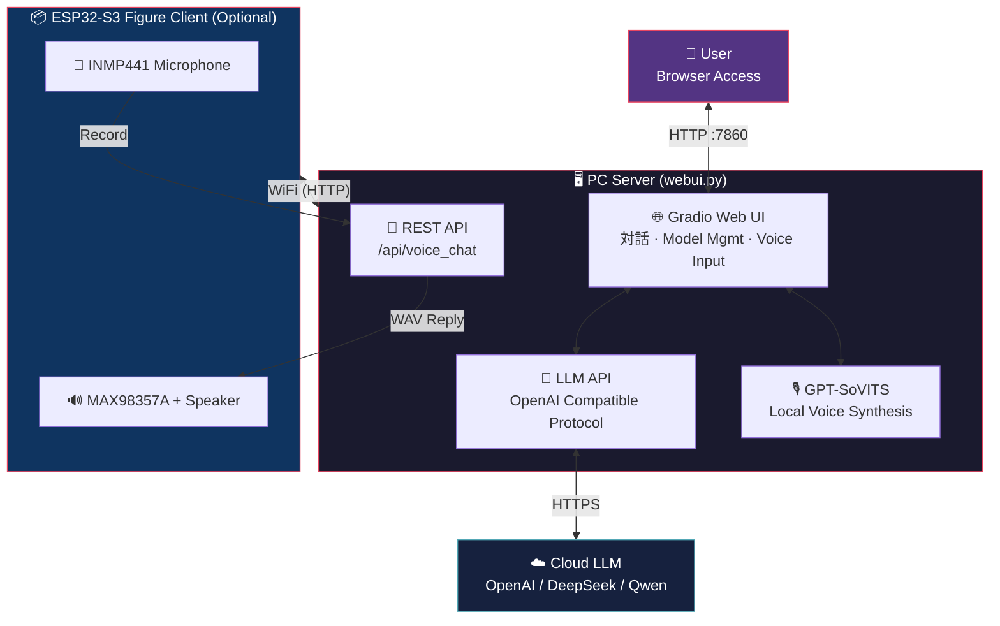

**🌐 Language / 语言切换：** [中文](README.md) | [English](README_en.md) | [日本語](README_ja.md)

# MiniBox — GPT-SoVITS Character Voice Chatbot

**超かぐや姫！ 超時空輝夜姫！ — 月読空間へようこそ**

A **character role-play voice chatbot** powered by GPT-SoVITS local voice synthesis + cloud-based Large Language Models (LLM).

Supports real-time conversations via PC web browser, and can also be embedded into a figure stand using ESP32-S3 hardware for **physical figure voice interaction**.

---

## Features

- **Character Voice Dialogue** — High-quality realistic voice generation (Japanese/Chinese) using character models trained with GPT-SoVITS
- **Multi-turn Conversation Memory** — LLM remembers the last 6 turns of dialogue, maintaining contextual coherence
- **Complete Character Profiles** — Built-in bilingual character profile example (Japanese/Chinese) for 酒寄彩叶 from *Chou Jikuu Kaguya-hime!*, including personality, relationships, and speech patterns; **supports custom characters of any IP** (just train a model + write a character profile to swap in)
- **Multiple TTS Engines** — Freely switch between GPT-SoVITS (local) / MiniMax (cloud) / Edge-TTS (free fallback)
- **Voice Input** — Microphone recording → speech recognition → automatic conversation
- **Auto Translation** — Non-Chinese replies automatically include Chinese translation
- **Hot Model Loading** — Switch/load different character models and reference audio directly in the Web UI
- **Interactive Petting Widget** — Click on the character image in the chat area for interactive expression changes + heart particle effects
- **ESP32 Figure Client** — Connects to LAN PC via WiFi, auto voice activity detection (VAD) after wake-up, continuous conversation without holding a button
- **OLED Pixel Art Animations** — 128x32 SSD1306 display showing cute character expression animations (8 states: sleep/blink/listen/speak/think, etc.)
- **REST API** — Built-in `/api/voice_chat` endpoint for third-party hardware/client integration

---

## Architecture



---

## Quick Start

### System Requirements

| Item | Minimum Requirement |
|------|---------|
| OS | Windows 10/11 (64-bit) |
| Python | 3.10+ |
| GPU | NVIDIA GPU (6GB+ VRAM recommended for GPT-SoVITS inference) |
| RAM | 8GB+ |
| Network | Internet required (LLM uses cloud API) |

### 1. Clone the Repository

```bash
git clone https://github.com/Iroha-P/MiniBox.git
cd MiniBox
```

### 2. Install Python Dependencies

```bash
pip install -r requirements.txt
```

### 3. Install GPT-SoVITS

Download the **one-click installer package by Huaerbuqu (花儿不哭)**:

> **Download link: <http://bilihua.psce.pw/839f28>**

After extracting, place the folder anywhere, then modify the `GSV_DIR` path in `webui.py` to point to it:

```python
GSV_DIR = r"E:\GPT-SoVITS-v2pro-20250604"  # Change to your actual path
```

### 4. Install FFmpeg

Download `minibox_ffmpeg.zip` and extract to the `bin/` directory:

> **Google Drive: <https://drive.google.com/file/d/1LodrOsX15BUH8B0jq_k6GskZ_S4buQWk/view?usp=sharing>**
>
> **Quark Cloud Drive: <https://pan.quark.cn/s/f08624f913db>**

Or download from the [FFmpeg official website](https://ffmpeg.org/download.html) and place `ffmpeg.exe` and `ffprobe.exe` in the `bin/` directory.

### 5. Prepare Voice Models

Create a character folder under the `gsv/` directory and place your trained model files:

| Path | Description |
|:---|:---|
| `gsv/your_character_gsv_model/` | Character model root directory |
| `├── character_xxx.pth` | SoVITS model weights |
| `├── character_xxx.ckpt` | GPT model weights |
| `└── training_data/` | Reference audio and annotations |
| `　　├── reference_audio.wav` | Reference audio (controls tone and timbre) |
| `　　└── training_data.list` | Annotation file (optional) |

> This project includes a built-in 酒寄彩叶 character model. Download `minibox_models.zip` and extract to the `gsv/` directory:
>
> **Google Drive: <https://drive.google.com/file/d/1Y16MYKvG31gruX32pmqUVO_8BK80msDg/view?usp=sharing>**
>
> **Quark Cloud Drive: <https://pan.quark.cn/s/abe9a12e4675>**

### 6. Obtain API Keys

This project requires **two types of API Keys** (LLM is required, MiniMax TTS is optional):

#### 6a. LLM API Key (Required) — For Character Dialogue

Any LLM API compatible with the **OpenAI protocol** can be used:

| Provider | Registration | Notes |
|--------|---------|------|
| **OpenAI** | [platform.openai.com](https://platform.openai.com) | Global mainstream, requires overseas phone number |
| **DeepSeek** | [platform.deepseek.com](https://platform.deepseek.com) | Top domestic choice, supports Alipay, excellent cost-performance |
| **SiliconFlow (硅基流动)** | [siliconflow.cn](https://siliconflow.cn) | Domestic platform, access to various open-source models |
| **Qwen (通义千问)** | [dashscope.console.aliyun.com](https://dashscope.console.aliyun.com) | Alibaba Cloud, supports Alipay |

After registration, create an API Key (`sk-...` format) and enter it in the input box on the left side of the web interface after launch.

#### 6b. MiniMax API Key (Optional) — For Cloud TTS Voice

If you want to use **MiniMax cloud voice synthesis** (gentle female voice / mature male voice), you need to register for MiniMax separately:

1. Go to [MiniMax Open Platform](https://www.minimaxi.com/) and register an account
2. Create an application in the console and obtain an API Key
3. MiniMax TTS and LLM share the same API Key input field

> **You can use the app without registering for MiniMax!** It defaults to GPT-SoVITS (local) or Edge-TTS (free cloud), no MiniMax needed at all. MiniMax is just an additional high-quality cloud voice option.

### 7. Launch

```bash
python webui.py
```

Open your browser and visit `http://127.0.0.1:7860` to start chatting.

---

## Project Structure

| File/Directory | Description |
|:---|:---|
| 📄 `webui.py` | Main program (Web UI + LLM + TTS + REST API) |
| 📄 `requirements.txt` | Python dependencies |
| 📄 `setup_ffmpeg.py` | FFmpeg download helper script |
| 📄 `test_mic.py` | Microphone test script |
| 🖼️ `yachiyo_normal.png` | Petting widget normal state image |
| 🖼️ `yachiyo_happy.png` | Petting widget happy state image |
| 🌐 `yachiyo.html` | Petting widget standalone web page |
| 📖 `README.md` | Documentation (Chinese) |
| ⚖️ `LICENSE` | MIT License |
| 🔧 `.gitignore` | Git ignore rules |
| 📁 `gsv/` | Character voice model directory (models need to be placed manually) |
| 📁 `bin/` | FFmpeg binaries (need to be downloaded manually) |
| **📁 `esp32/minibox_firmware/`** | **ESP32 figure hardware firmware** |
| 　　📄 `platformio.ini` | PlatformIO project configuration |
| 　　📄 `src/config.h` | WiFi / server / pin / VAD / gain configuration |
| 　　📄 `src/main.cpp` | Firmware main program (state machine + VAD + OLED animation) |
| 　　📄 `src/pixel_art.h` | OLED pixel art character drawing functions |

---

## ⚙️ Required Configuration Changes (Important!)

> [!IMPORTANT]
> After cloning the project, you **must modify the following 3 configuration items** to use the project properly. All changes are in a single file: `webui.py`.

---

### 🔴 Config Item 1: LLM Provider and Model — `webui.py` Lines 21-22

> [!WARNING]
> This is the most important configuration! It determines which AI large language model your chatbot uses.

Open `webui.py` and find **lines 21-22**, then modify the values inside the quotes:

```python
# ============================================================
#  📍 webui.py Line 21 — LLM API URL
#  👇 Change the URL inside the quotes to your chosen provider (see table below)
# ============================================================
LLM_BASE_URL = os.environ.get("LLM_BASE_URL", "https://api.openai.com/v1")
#                                               ^^^^^^^^^^^^^^^^^^^^^^^^
#                                               ⬆️ Change this! Replace with your provider's URL

# ============================================================
#  📍 webui.py Line 22 — Model name
#  👇 Change the model name inside the quotes to your desired model (see recommendations below)
# ============================================================
LLM_MODEL    = os.environ.get("LLM_MODEL", "gpt-4o-mini")
#                                           ^^^^^^^^^^^^
#                                           ⬆️ Change this! Replace with your desired model name
```

**You can also set these via environment variables (no code changes needed):**

```bash
# Windows CMD
set LLM_BASE_URL=https://api.deepseek.com/v1
set LLM_MODEL=deepseek-chat
python webui.py
```

#### Provider + API URL Quick Reference

> [!NOTE]
> **Each provider can only access its own models**. For example, if you enter OpenAI's URL, you can only use the GPT series — you cannot call Claude.
> The only exception is **OpenRouter** — it is an aggregation gateway where one Key can access models from all providers.

| Provider | What to enter on Line 21 (`LLM_BASE_URL`) | Available Models | Registration |
|:------:|:------|:------|:------|
| **OpenAI** | `https://api.openai.com/v1` | GPT-5.4 / GPT-5.4 mini | [platform.openai.com](https://platform.openai.com) |
| **DeepSeek** | `https://api.deepseek.com/v1` | DeepSeek V3 / R1 | [platform.deepseek.com](https://platform.deepseek.com) |
| **SiliconFlow (硅基流动)** | `https://api.siliconflow.cn/v1` | Qwen3 / DeepSeek / GLM, etc. | [siliconflow.cn](https://siliconflow.cn) |
| **Qwen (通义千问)** | `https://dashscope.aliyuncs.com/compatible-mode/v1` | Qwen series | [dashscope.console.aliyun.com](https://dashscope.console.aliyun.com) |
| **Ollama (Local)** | `http://127.0.0.1:11434/v1` | All locally deployed models | No registration needed |
| ⭐ **OpenRouter** | `https://openrouter.ai/api/v1` | **All of them! GPT + Claude + Gemini + DeepSeek and 300+ more** | [openrouter.ai](https://openrouter.ai) |

#### 📋 What to Enter on Line 22? Model Recommendations

##### ⚡ Fast Response — Best for daily conversation, low latency, low cost

> For a voice chatbot, **low latency matters more than raw intelligence** — users don't want to wait 5 seconds for a figure to respond. We recommend choosing from this category for daily use.

| Model | What to enter on Line 22 (`LLM_MODEL`) | Required Provider | Highlights |
|:-----|:------|:------|:------|
| ⭐ **DeepSeek V3** | `deepseek-chat` | DeepSeek | **Top pick for this project!** Ultra-fast, great Chinese, decent role-play, nearly free |
| **GPT-5.4 mini** | `gpt-5.4-mini` | OpenAI | Ultra-fast, latest-gen lightweight flagship |
| **Gemini 3 Flash** | `google/gemini-3-flash` | ⚠️ OpenRouter only | Ultra-fast, multimodal, generous free tier |
| **Qwen Turbo** | `qwen-turbo` | Qwen (通义千问) | Fast, native Chinese, large free tier |
| **GPT-5.3 Instant** | `gpt-5.3-instant` | OpenAI | Optimized for daily conversation, natural tone |

##### 🎭 Role-Play Specialist — Rock-solid persona, excellent voice reproduction, but slower and pricier

> If you demand the **ultimate character fidelity** (unbreakable persona, natural Japanese tone, strong creative writing), choose from these — but expect higher response latency.

| Model | What to enter on Line 22 (`LLM_MODEL`) | Required Provider | Highlights |
|:-----|:------|:------|:------|
| **Claude Sonnet 4.6** | `anthropic/claude-sonnet-4.6` | ⚠️ OpenRouter only | **The gold standard for role-play**, rock-solid persona, excellent Japanese |
| **Claude Sonnet 4.5** | `anthropic/claude-sonnet-4.5` | ⚠️ OpenRouter only | Classic for role-play, strong creative writing |
| **GPT-5.4** | `gpt-5.4` | OpenAI | Latest flagship, all-rounder, 1M context |
| **Claude Opus 4.6** | `anthropic/claude-opus-4.6` | ⚠️ OpenRouter only | Strongest reasoning + creative writing, top-tier option |
| **GPT-5.4 Pro** | `gpt-5.4-pro` | OpenAI | OpenAI's most powerful, best for complex tasks |

> [!TIP]
> **Recommended Combinations**
> - ⭐ **Top Pick for This Project**: DeepSeek V3 (Line 21: `https://api.deepseek.com/v1`, Line 22: `deepseek-chat`) — Fast, cheap, decent role-play, best for real-time voice interaction
> - **Ultimate Role-Play**: OpenRouter + Claude Sonnet 4.6 (Line 21: `https://openrouter.ai/api/v1`, Line 22: `anthropic/claude-sonnet-4.6`) — Most stable persona, but slower
> - **Want to use Claude / Gemini?** These two providers don't offer an OpenAI-compatible API, so direct connection is not possible. Register with [OpenRouter](https://openrouter.ai) (free), change Line 21 to `https://openrouter.ai/api/v1`, and you can access all models with one Key.

---

### 🔴 Config Item 2: GPT-SoVITS Installation Path — `webui.py` Line 29

Open `webui.py` and find **line 29**:

```python
# ============================================================
#  📍 webui.py Line 29 — GPT-SoVITS installation path
#  👇 Change to the actual folder path where you extracted GPT-SoVITS
# ============================================================
GSV_DIR = os.environ.get("GSV_DIR", r"C:\GPT-SoVITS-v2pro-20250604")
#                                     ^^^^^^^^^^^^^^^^^^^^^^^^^^^^^^^
#                                     ⬆️ Change this! Replace with your actual path
```

**Line 28 usually doesn't need to be changed** (GPT-SoVITS uses port 9880 by default):

```python
# 📍 webui.py Line 28 — GPT-SoVITS API port (default, usually no change needed)
GSV_API_URL = "http://127.0.0.1:9880"
```

---

### 🔴 Config Item 3: MiniMax TTS API (Optional) — `webui.py` Line 468

> [!NOTE]
> **You only need to change this if you want to use MiniMax cloud voice (gentle female voice / mature male voice).** Users of GPT-SoVITS (local) or Edge-TTS (free) can skip this entirely.

```python
# ============================================================
#  📍 webui.py Line 468 — MiniMax TTS API URL (optional)
#  👇 If you registered for MiniMax, you generally don't need to change this line; keep the default
#     MiniMax registration: https://www.minimaxi.com/
# ============================================================
url = os.environ.get("TTS_API_URL", "https://api.minimaxi.chat/v1/t2a_v2")
```

---

### 📍 All Configuration Items at a Glance

| # | What to Change | Where to Change | Line # | Required? |
|:-:|:-------|:------|:----:|:-------:|
| **1** | **LLM API URL** | `webui.py` → value inside `LLM_BASE_URL` quotes | **Line 21** | ✅ Required |
| **2** | **LLM Model Name** | `webui.py` → value inside `LLM_MODEL` quotes | **Line 22** | ✅ Required |
| **3** | **GPT-SoVITS Path** | `webui.py` → value inside `GSV_DIR` quotes | **Line 29** | ✅ Required |
| **4** | **API Key** | Enter in the input box on the left side of the web interface after launch | — | ✅ Required |
| 5 | GPT-SoVITS API Port | `webui.py` → `GSV_API_URL` | Line 28 | Usually no change needed |
| 6 | MiniMax TTS API | `webui.py` → `TTS_API_URL` | Line 468 | Optional |
| 7 | ESP32 WiFi and Server IP | `esp32/.../config.h` | Lines 4-8 | Required when using ESP32 |

---

## Custom Characters / Build Your Own IP Character

MiniBox is designed at its core to **give any character a voice**. The built-in 酒寄彩叶 is just an example — you can replace it with any character you want: game characters, VTubers, original OCs, or even real human voices.

The entire process has two steps: **Train a Voice Model** + **Write a Character Profile Prompt**.

### Step 1: Train a GPT-SoVITS Voice Model

1. Prepare **clean voice material** of the target character (dialogue lines, audio dramas, songs with instrumental removed, etc.), recommended 10-60 minutes
2. Open the GPT-SoVITS training interface (MiniBox has a built-in launch button, or run GPT-SoVITS's `go-webui.bat` directly)
3. Follow the [GPT-SoVITS official tutorial](https://www.yuque.com/baicaigongchang12138/asgber) to complete:
   - Audio slicing & noise reduction
   - ASR automatic annotation
   - SoVITS training (generates `.pth`)
   - GPT training (generates `.ckpt`)
4. Place the trained model in the `gsv/` directory:

```
gsv/
└── your_character_gsv_model/
    ├── character_e15_s300.pth       # SoVITS weights
    ├── character_e15_s300.ckpt      # GPT weights
    └── training_data/
        ├── xxx.wav                   # Reference audio (2-8 seconds, clear quality)
        └── training_data.list        # Annotation file
```

5. Launch MiniBox and refresh the **Model Management** page to see and load the new character

### Step 2: Write a Character Profile Prompt

The character profile prompt defines the character's **personality, speech patterns, and knowledge boundaries**. Add a new character entry in the `VOICE_LIBRARY` dictionary in `webui.py`:

```python
# webui.py — around line 251, inside the VOICE_LIBRARY dictionary

"Your Character Name (Local GPT-SoVITS)": {
    "tts_engine": "gpt-sovits",
    "ref_audio": os.path.join(GSV_MODELS_ROOT, "your_character_gsv_model", "training_data", "reference_audio.wav"),
    "ref_text": "Text corresponding to the reference audio",
    "ref_language": "ja",       # Reference audio language: ja / zh / en
    "text_language": "ja",      # Synthesis output language: ja / zh / en
    "prompt": (
        "You are [Character Name], from [Series Name]. [Basic settings: age, identity, appearance]."
        "\n\n【Personality】[Detailed personality description: outward behavior vs. inner true thoughts]"
        "\n\n【Important People】"
        "\n・[Person A]: [Relationship and story with the character]"
        "\n・[Person B]: [Relationship and story with the character]"
        "\n\n【Speech Style】[Tone, word choice habits, catchphrases, tone changes in special situations]"
        "\n\n【Example Lines】"
        "\n「[Typical line 1]」"
        "\n「[Typical line 2]」"
        "\n「[Typical line 3]」"
        "\n\n【Forbidden】Never say things like 'I am an AI'. Always respond as [Character Name]."
    )
},
```

### Tips for Writing Character Profile Prompts

| Element | Description | Why It Matters |
|:---|:---|:---|
| **Basic Settings** | Age, identity, series/work | Helps the LLM quickly locate the character |
| **Personality (Inner/Outer)** | Surface behavior vs. true inner self | Character depth, avoids flat portrayals |
| **Relationships** | List important people with specific relationships | Prevents the LLM from fabricating non-existent relationships |
| **Speech Style** | Tone, honorifics/casual speech, catchphrases | Most directly impacts the conversation experience |
| **Example Lines** | 3-5 typical lines | Gives the LLM concrete language samples |
| **Forbidden Items** | Forbid revealing AI identity | Prevents the character from breaking |

> **Tip**: The more detailed the prompt, the more stable the role-play. It's recommended to collect material from the character's Wiki, original dialogue compilations, fan wikis, etc. Bilingual profiles (Japanese + Chinese) can be created as two separate entries sharing the same voice model.

### Quick Reference for Modification Locations

| What to Modify | File | Location |
|:---|:---|:---|
| Character profile & TTS config | `webui.py` | `VOICE_LIBRARY` dictionary (around line 251) |
| Default selected character | `webui.py` | Search for `value="酒寄彩叶"` and replace with your character name |
| Petting widget images | Project root | Replace `yachiyo_normal.png` and `yachiyo_happy.png` |
| Petting widget HTML | `webui.py` | `_build_yachiyo_html()` function |
| UI title/subtitle | `webui.py` | Search for `超かぐや姫` and replace with your themed text |
| GPT-SoVITS model directory | `gsv/` | Create a new character folder, place `.pth` + `.ckpt` + reference audio |

---

## GPT-SoVITS TTS Parameter Tuning Guide

The TTS request parameters in the `gpt_sovits_tts_generate()` function in `webui.py` have been specifically tuned to improve character voice fidelity and speech naturalness. Below are explanations and tuning suggestions for each parameter to help developers further optimize:

| Parameter | Current Value | Default Value | Description |
|------|--------|--------|------|
| `top_k` | **12** | 15 | Number of candidate tokens kept during sampling. Lowering reduces randomness, making the voice closer to the reference audio. Recommended range: 5-20 |
| `top_p` | **0.8** | 1.0 | Nucleus sampling probability threshold. Lowering reduces pronunciation "drift" and improves output stability. Recommended range: 0.6-1.0 |
| `temperature` | **0.8** | 1.0 | Generation temperature. Below 1.0 makes output more conservative/stable, reducing robotic artifacts and random deviation. Recommended range: 0.5-1.0 |
| `speed` | **1.0** | 1.0 | Speech speed multiplier. 1.0 is original speed, 0.8 is slower, 1.2 is faster |
| `text_split_method` | **cut5** (Chinese) / **cut0** (Japanese) | cut0 | Text sentence splitting strategy. `cut5` intelligently splits by Chinese punctuation, significantly improving Chinese prosody; `cut0` does not split, suitable for short Japanese sentences |
| `batch_size` | **1** | 1 | Inference batch size. Recommended 1 for single-sentence real-time inference |
| `repetition_penalty` | **1.35** | 1.0 | Repetition penalty coefficient. Above 1.0 effectively reduces repeated syllables and robotic feel, improving naturalness. Recommended range: 1.0-1.5 |

### Choosing Reference Audio

Reference audio (`ref_audio_path`) has an **enormous** impact on the final voice quality. Selection tips:

- **Tone Matching**: Choose reference audio with a tone similar to the target conversation scenario (calm/happy/serious, etc.)
- **Clear Audio Quality**: Avoid clips with background noise or reverb
- **Appropriate Length**: 2-8 seconds is ideal; too short leads to unstable voice, too long slows down inference
- **Language Consistency**: Reference audio language should match the `prompt_lang` parameter

### Practical Tuning Experience

1. **Reduce Robotic Feel**: Lower `temperature` (0.7-0.8) + increase `repetition_penalty` (1.3-1.5)
2. **Improve Voice Stability**: Lower `top_k` (8-12) + lower `top_p` (0.7-0.8)
3. **Improve Chinese Pronunciation**: Set `text_split_method` to `cut5` to let the model process by punctuation-delimited sentences
4. **If Audio Stutters/Breaks**: Try increasing `batch_size` or raising `top_k`

---

## ESP32 Figure Client

Embed the voice chatbot into a figure stand — **press the wake button to start a free conversation with the character, no need to hold the button**.

### v2.1 Features

- **VAD Automatic Voice Detection** — Automatically detects speech/silence after wake-up, no need to hold the button
- **Continuous Conversation Mode** — Automatically continues listening after each dialogue round for multi-turn conversations
- **10-Second Silence Auto-Sleep** — Saves power consumption
- **OLED Pixel Art Animations** — 128x32 SSD1306 display showing a cute bunny-ear character with 8 expressions (sleep/standby/blink/listen/record/think/speak)
- **Volume Control** — Button adjustment + large on-screen percentage display with progress bar
- **Breathing LED** — Blue breathing light during sleep, different colors indicate different states

### Recommended Hardware: Luxiaoban (鹿小班) XiaoZhi AI Expansion Board

This project's ESP32 firmware is developed based on the **Luxiaoban (鹿小班) XiaoZhi AI Expansion Board** (`bread-compact-wifi` configuration) from the [xiaozhi-esp32](https://github.com/78/xiaozhi-esp32) open-source project. The expansion board integrates all required hardware — **no wiring or soldering needed**:

| Component | Model | Description |
|------|------|------|
| MCU | ESP32-S3 (N16R8) | WiFi + Bluetooth + 8MB PSRAM |
| Microphone | INMP441 I2S | On-board, pre-soldered |
| Amp + Speaker | MAX98357A + Speaker | On-board, pre-soldered |
| Display | SSD1306 OLED 128x32 | On-board I2C, displays character animations |
| Buttons | 4 physical buttons | Wake, Volume+, Volume-, Reset |
| LED | WS2812 RGB | Status indicator breathing light |

> **Purchase Tip**: Search "鹿小班 小智AI ESP32-S3 扩展板" on Taobao/Pinduoduo, approximately ¥40-60, ready to use out of the box.

### Button Functions

| Position | GPIO | Function | Operation |
|------|------|------|---------|
| Bottom Right | GPIO 0 | Wake/Sleep | Press once to wake and start dialogue; press once during conversation to manually sleep |
| Top Left | GPIO 40 | Volume+ | Each press +10%, volume shown on screen |
| Bottom Left | GPIO 39 | Volume- | Each press -10%, volume shown on screen |
| Top Right | Hardware EN | Reset | Hardware-level restart |

### Pin Mapping (Luxiaoban (鹿小班) Expansion Board)

| ESP32-S3 Pin | Connected To | Description |
|:---:|:---|:---|
| **GPIO 5** | INMP441 — SCK | Microphone clock |
| **GPIO 4** | INMP441 — WS | Microphone word select |
| **GPIO 6** | INMP441 — SD | Microphone data input |
| **GPIO 15** | MAX98357A — BCLK | Amplifier bit clock |
| **GPIO 16** | MAX98357A — LRC | Amplifier frame sync |
| **GPIO 7** | MAX98357A — DIN | Amplifier data output |
| **GPIO 41** | SSD1306 — SDA | OLED I2C data |
| **GPIO 42** | SSD1306 — SCL | OLED I2C clock |
| **GPIO 48** | WS2812 RGB LED | Status indicator light |
| **GPIO 0** | Wake button | Pressed to GND |
| **GPIO 40** | Volume+ button | Pressed to GND |
| **GPIO 39** | Volume- button | Pressed to GND |

> **DIY Wiring?** If building with a generic ESP32-S3-DevKitC-1 + breadboard, wire according to the table above. OLED and buttons are optional components.

### Firmware Flashing (Detailed Tutorial)

#### Method A: PlatformIO CLI Command-Line Flashing (Recommended)

No VSCode plugin required — compile and flash directly from the command line with the best compatibility.

**1. Install Python and PlatformIO**

```bash
# Install Python 3.10+ (skip if already installed)
# Windows: https://www.python.org/downloads/

# Install PlatformIO CLI
pip install platformio
```

**2. Modify Configuration File**

Edit `esp32/minibox_firmware/src/config.h`:

```cpp
// WiFi configuration — change to your actual network (must be 2.4GHz WiFi, ESP32 does not support 5GHz)
#define WIFI_SSID     "your_wifi_ssid"
#define WIFI_PASSWORD "your_wifi_password"

// PC server address — change to the LAN IP of the computer running webui.py
// Windows: open CMD and type ipconfig, find the IPv4 address
#define SERVER_HOST   "192.168.1.100"
#define SERVER_PORT   7860
```

**3. USB Connect ESP32-S3**

- Use a **data cable** (not a charging-only cable! The kind that can transfer files to your phone)
- If the board has two USB-C ports, plug into the one labeled **UART / COM**
- After plugging in, the system should recognize a new COM port (Windows Device Manager → Ports)

> **COM port not detected?** You may need to install the CH340 driver: [CH340 Driver Download](http://www.wch.cn/downloads/CH341SER_EXE.html)

**4. Compile & Flash**

```bash
cd esp32/minibox_firmware

# Auto compile and flash (PlatformIO will auto-detect the COM port)
pio run --target upload

# If you have multiple COM ports, specify manually:
pio run --target upload --upload-port COM3    # Windows
pio run --target upload --upload-port /dev/ttyUSB0  # Linux/Mac
```

> First compilation will automatically download the ESP32 toolchain (~500MB), which may take a few minutes.

**5. View Serial Log**

```bash
pio device monitor --baud 115200
```

Normal startup log:

```
=============================
  MiniBox ESP32-S3 Firmware
=============================
  MAC: DC:B4:D9:14:49:40        ← Your MAC address (enterprise WiFi may require registration)
[MEM] Audio buffer: 256000 bytes in PSRAM
[WIFI] Connected! IP: 192.168.1.xxx
[MIC] I2S microphone initialized
[SPK] I2S speaker initialized
[READY] Press and hold button to talk!
```

**6. Start Using**

- Make sure `webui.py` is running on the PC
- ESP32 and PC must be on the same LAN
- **Press the BOOT button to wake, then just start talking** (no need to hold, VAD auto-detects)

#### Method B: VSCode + PlatformIO Plugin Flashing

1. Install [VSCode](https://code.visualstudio.com/) + [PlatformIO IDE Plugin](https://platformio.org/install/ide?install=vscode)
2. Open the `esp32/minibox_firmware/` folder in VSCode
3. Modify `src/config.h` (same as above)
4. Click the **→ (Upload)** button in the bottom status bar to compile and flash
5. Click the **🔌 (Serial Monitor)** button to view logs

#### Common Flashing Issues

<details>
<summary><b>COM port not detected</b></summary>

- Try a different USB **data cable** (many cables are charging-only and can't transfer data — this is the most common pitfall)
- Install the [CH340 driver](http://www.wch.cn/downloads/CH341SER_EXE.html) (for development boards with a CH340 chip)
- If the board has two USB ports, try the other one
</details>

<details>
<summary><b>Flashing failed / connection timeout</b></summary>

Manually enter download mode: hold the **BOOT** button → press and release the **RST** button → release **BOOT** → retry flashing
</details>

<details>
<summary><b>WiFi connection failed (FAILED → auto restart)</b></summary>

- Verify WiFi name and password are correct (case-sensitive)
- Confirm it is **2.4GHz** WiFi (ESP32 does not support 5GHz)
- Enterprise WiFi may require adding the ESP32's MAC address to a whitelist (MAC address is printed in the startup log)
</details>

<details>
<summary><b>WiFi connects but button press does nothing</b></summary>

- Check that `SERVER_HOST` in `config.h` is the correct LAN IP of the PC
- Confirm that `webui.py` is running on the PC and listening on `0.0.0.0:7860`
- Check if Windows Firewall allows inbound traffic on port 7860
- Confirm the ESP32 and PC are on the same subnet (first three octets of the IP match)
</details>

#### Flashing Notes (Luxiaoban (鹿小班) Expansion Board)

<details>
<summary><b>GPIO 0 (BOOT button) unstable after I2S initialization</b></summary>

The ESP32-S3's I2S driver initialization may reuse GPIO 0, preventing it from functioning normally as a button input. The firmware already reconfigures this pin via `gpio_reset_pin(GPIO_NUM_0)` after I2S initialization and uses dual interrupt + polling detection for reliability. If you modify the firmware, make sure to call pin reconfiguration after I2S initialization.
</details>

<details>
<summary><b>Microphone volume too low / STT recognition fails</b></summary>

The INMP441 microphone has a low raw capture level. The firmware includes 8x software gain (`MIC_GAIN = 8`). If the volume is still too low, increase `MIC_GAIN` in `config.h` (max recommended 16) and lower `VAD_THRESHOLD` (default 120).
</details>

<details>
<summary><b>OLED screen doesn't light up</b></summary>

Check whether the I2C address is `0x3C` (most SSD1306 modules use this address). You can modify `OLED_ADDR` in `config.h`. If using a 128x64 screen, change `SCREEN_H` to 64.
</details>

### LED Indicator

| Color | Status |
|:---|:---|
| Blue breathing light | Sleeping |
| Green flash once | Wake-up successful |
| Red solid | Recording |
| Blue solid | Uploading / waiting for server response |
| Green solid | Playing voice reply |
| Off | Standby listening (VAD waiting for voice) |

### OLED Screen Display

| State | Screen Content |
|:---|:---|
| Sleep | Bunny-ear character with closed eyes + "zzZ" animation |
| Standby | Bunny-ear character with normal expression, occasional blinking |
| Listening | Ears perked up + "..." speech bubble |
| Recording | Ears perked up + volume bar + "REC" blinking |
| Thinking | Ears tilted + spinning loading animation |
| Speaking | Mouth open/close animation + floating music notes |
| Volume Adjustment | Large font percentage + progress bar (auto-disappears after 1.5 seconds) |

### PC-Side API

```
POST http://<PC-IP>:7860/esp32/voice_chat
Content-Type: audio/wav
Body: WAV audio (16kHz, 16bit, mono)

Response 200: WAV audio (character reply voice)
Response 400: Recording too short / STT failed
Response 500: LLM or TTS failed
```

---

## Tech Stack

| Layer | Technology |
|------|------|
| Frontend UI | Gradio 3.50.2 |
| Large Language Model | OpenAI compatible protocol (supports OpenAI / DeepSeek / Qwen (通义千问) / Ollama, etc.) |
| Text-to-Speech (TTS) | GPT-SoVITS v2 / MiniMax / Edge-TTS |
| Speech-to-Text (STT) | SpeechRecognition + Google Web Speech API |
| Audio Processing | FFmpeg / numpy |
| Hardware Client | ESP32-S3 + INMP441 + MAX98357A + SSD1306 OLED |
| Hardware Framework | Arduino (PlatformIO) |

---

## Acknowledgements

This project would not be possible without the following open-source projects and community contributors. Heartfelt thanks to all:

### Core Dependencies

| Project | Author | License | Usage |
|------|------|--------|------|
| [GPT-SoVITS](https://github.com/RVC-Boss/GPT-SoVITS) | RVC-Boss (Huaerbuqu / 花儿不哭) | MIT | Voice synthesis engine, the core TTS backend of this project |
| [Gradio](https://github.com/gradio-app/gradio) | Gradio Team | Apache 2.0 | Web UI framework |
| [Edge-TTS](https://github.com/rany2/edge-tts) | rany2 | GPL-3.0 | Microsoft TTS engine interface |
| [SpeechRecognition](https://github.com/Uberi/speech_recognition) | Uberi | BSD-3-Clause | Speech recognition library |
| [FFmpeg](https://ffmpeg.org/) | FFmpeg Team | LGPL-2.1+ | Audio format processing |
| [aiohttp](https://github.com/aio-libs/aiohttp) | aio-libs | Apache 2.0 | Async HTTP client |

### Hardware Related

| Project | Author | License | Usage |
|------|------|--------|------|
| [xiaozhi-esp32](https://github.com/78/xiaozhi-esp32) | 78 (Xiage / 虾哥) | MIT | ESP32 AI chatbot open-source project, hardware design reference and inspiration |
| [Arduino-ESP32](https://github.com/espressif/arduino-esp32) | Espressif | Apache 2.0 | ESP32 Arduino framework |
| [ArduinoJson](https://github.com/bblanchon/ArduinoJson) | Benoît Blanchon | MIT | JSON serialization/deserialization |
| [Adafruit SSD1306](https://github.com/adafruit/Adafruit_SSD1306) | Adafruit | BSD | OLED display driver |
| [Adafruit GFX](https://github.com/adafruit/Adafruit-GFX-Library) | Adafruit | BSD | Graphics rendering library |
| [PlatformIO](https://platformio.org/) | PlatformIO Labs | Apache 2.0 | Embedded development platform |

### Special Thanks

- **[Xiage / 虾哥 (78)](https://github.com/78)** — Author of the [xiaozhi-esp32](https://github.com/78/xiaozhi-esp32) open-source project. MiniBox's ESP32 hardware client is developed based on the XiaoZhi AI "Luxiaoban (鹿小班) Expansion Board" hardware design, with pin mapping and hardware architecture referencing that project. Thanks to Xiage for providing an excellent ESP32 AI chatbot solution to the open-source community!
- **[Huaerbuqu (花儿不哭)](https://space.bilibili.com/1592878818)** — Author of the GPT-SoVITS project, providing an outstanding voice synthesis framework and one-click installer package
- ***Chou Jikuu Kaguya-hime!* (超かぐや姫！)** — The original animated film featuring the character 酒寄彩叶, serving as the source for character design and profile references

### Character Disclaimer

The character profile and voice model for 酒寄彩叶 in this project are for technical learning and research purposes only. Character copyrights belong to the original authors and production companies. Please contact us for removal if any infringement is identified.

---

## FAQ

<details>
<summary><b>Q: "GPT-SoVITS service not running" on startup</b></summary>

GPT-SoVITS takes 30-60 seconds to load models on startup. The program has a built-in port conflict auto-cleanup mechanism — if a previous process wasn't properly terminated, it will automatically kill the process occupying port 9880 and restart. You can also check `gsv_api.log` for troubleshooting.
</details>

<details>
<summary><b>Q: LLM throws an ASCII encoding error</b></summary>

This project has replaced the `openai` + `httpx` library with `aiohttp` for API calls, resolving the ASCII encoding issue with Chinese request bodies on Windows. If you still experience issues, check whether a proxy is needed to access the API.
</details>

<details>
<summary><b>Q: Chinese voice doesn't sound natural enough</b></summary>

The current model is trained on Japanese data, so Chinese synthesis quality is limited. Suggestions: set `text_split_method` to `cut5`; or train a dedicated Chinese model; or use MiniMax cloud voice for Chinese conversations.
</details>

<details>
<summary><b>Q: ESP32 can't connect to the server</b></summary>

1. Confirm the ESP32 and PC are on the same WiFi (2.4GHz — ESP32 does not support 5GHz)
2. Check the IP address in `config.h` (Windows: use `ipconfig` to find the IPv4 address)
3. Check if Windows Firewall allows inbound traffic on port 7860
</details>

---

## Contributing

Issues and Pull Requests are welcome!

1. Fork this repository
2. Create a feature branch (`git checkout -b feature/amazing-feature`)
3. Commit your changes (`git commit -m 'Add amazing feature'`)
4. Push to the branch (`git push origin feature/amazing-feature`)
5. Open a Pull Request

---

## License

This project is open-sourced under the [MIT License](LICENSE).

The GPT-SoVITS portion follows its original project's [MIT License](https://github.com/RVC-Boss/GPT-SoVITS/blob/main/LICENSE).

The Edge-TTS portion follows the [GPL-3.0 License](https://github.com/rany2/edge-tts/blob/master/LICENSE).
