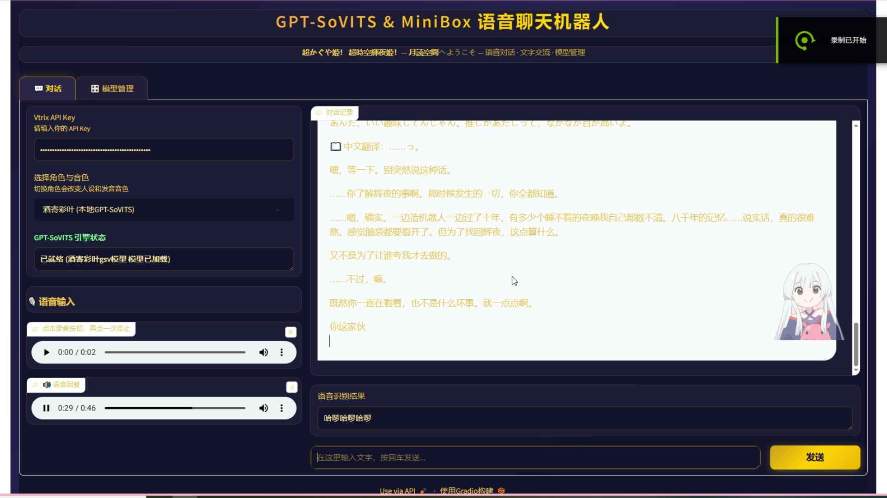
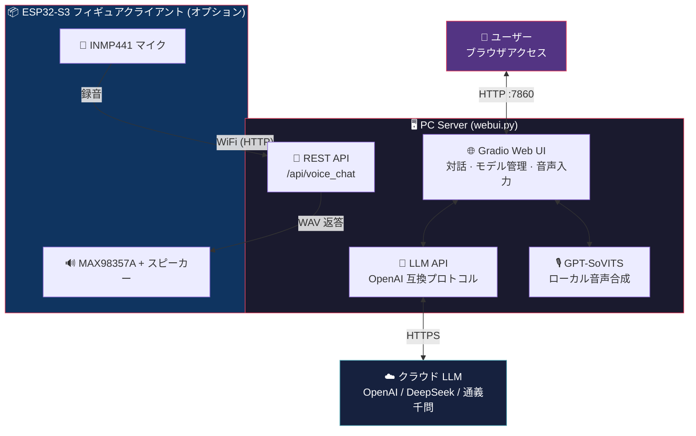

**🌐 Language / 言語切替：** [中文](README.md) | [English](README_en.md) | [日本語](README_ja.md)

# MiniBox — GPT-SoVITS キャラクターボイスチャットボット

**超かぐや姫！ 超時空輝夜姫！ — 月読空間へようこそ**

GPT-SoVITS ローカル音声合成 + クラウド大規模言語モデル（LLM）をベースとした**キャラクターなりきりボイスチャットボット**です。

PC のブラウザでリアルタイム対話ができるほか、ESP32-S3 ハードウェアをフィギュア台座に組み込むことで、**実物フィギュアとの音声インタラクション**も実現できます。

---

## デモ動画

### 🖥️ PC コントロールパネル デモ

[](https://github.com/Iroha-P/MiniBox/raw/main/demo_pc.mp4)

> 上の画像をクリックして動画を再生

---

## Features / 機能ハイライト

- **キャラクターボイス対話** — GPT-SoVITS で学習したキャラクターモデルにより、高品質でリアルな音声を生成（日本語／中国語）
- **マルチターン対話メモリ** — LLM が直近 6 ターンの対話を記憶し、キャラクターが文脈を一貫して保持
- **完全なキャラクター設定** — 『超時空輝夜姫！』酒寄彩葉のバイリンガル設定サンプル（日本語／中国語）を内蔵。性格・人間関係・口調ルールを含む。**任意の IP キャラクターへのカスタマイズにも対応**（モデルの学習 + キャラクター設定の記述で差し替え可能）
- **マルチ TTS エンジン** — GPT-SoVITS（ローカル）/ MiniMax（クラウド）/ Edge-TTS（無料フォールバック）を自由に切替
- **音声入力** — マイク録音 → 音声認識 → 自動対話に対応
- **自動翻訳** — 非中国語の回答には中国語翻訳を自動付加
- **モデルホットロード** — Web UI から直接キャラクターモデルやリファレンス音声を切替・ロード可能
- **インタラクティブなでなでモード** — 対話エリアのキャラクター画像をクリックして、表情切替＋ハートパーティクル演出
- **ESP32 フィギュアクライアント** — WiFi 経由で LAN 内の PC に接続。ボタンで起動後は自動音声検出（VAD）で、ボタンを押し続けなくても連続対話が可能
- **OLED ピクセルアートアニメーション** — 128x32 SSD1306 ディスプレイにかわいいキャラクターの表情アニメーションを表示（スリープ／まばたき／リスニング／スピーキング／シンキングなど 8 種類の状態）
- **REST API** — 内蔵の `/api/voice_chat` エンドポイントで、サードパーティのハードウェアやクライアントからの接続に対応

---

## Architecture / システムアーキテクチャ



---

## Quick Start / クイックスタート

### 動作環境

| 項目 | 最低要件 |
|------|---------|
| OS | Windows 10/11 (64 ビット) |
| Python | 3.10+ |
| GPU | NVIDIA GPU（VRAM 6GB 以上推奨、GPT-SoVITS 推論用） |
| メモリ | 8GB 以上 |
| ネットワーク | インターネット接続必須（LLM はクラウド API を使用） |

### 1. リポジトリのクローン

```bash
git clone https://github.com/Iroha-P/MiniBox.git
cd MiniBox
```

### 2. Python 依存パッケージのインストール

```bash
pip install -r requirements.txt
```

### 3. GPT-SoVITS のインストール

**花儿不哭（RVC-Boss）氏によるオープンソースのワンクリックインストーラー**をダウンロードしてください：

> **ダウンロード先：<http://bilihua.psce.pw/839f28>**

解凍したフォルダを任意の場所に配置し、`webui.py` 内の `GSV_DIR` パスをそのフォルダに向けてください：

```python
GSV_DIR = r"E:\GPT-SoVITS-v2pro-20250604"  # 実際のパスに変更してください
```

### 4. FFmpeg のインストール

`minibox_ffmpeg.zip` をダウンロードして `bin/` ディレクトリに解凍してください：

> **Google Drive：<https://drive.google.com/file/d/1LodrOsX15BUH8B0jq_k6GskZ_S4buQWk/view?usp=sharing>**
>
> **Quark ネットディスク：<https://pan.quark.cn/s/f08624f913db>**

または [FFmpeg 公式サイト](https://ffmpeg.org/download.html) から直接ダウンロードし、`ffmpeg.exe` と `ffprobe.exe` を `bin/` ディレクトリに配置してください。

### 5. 音声モデルの準備

`gsv/` ディレクトリにキャラクターフォルダを作成し、学習済みモデルファイルを配置してください：

| パス | 説明 |
|:---|:---|
| `gsv/キャラクター名gsvモデル/` | キャラクターモデルのルートディレクトリ |
| `├── キャラクター名_xxx.pth` | SoVITS モデル重み |
| `├── キャラクター名_xxx.ckpt` | GPT モデル重み |
| `└── 訓練集/` | リファレンス音声とアノテーション |
| `　　├── reference_audio.wav` | リファレンス音声（語気・音色の制御用） |
| `　　└── 訓練集.list` | アノテーションファイル（任意） |

> 本プロジェクトには「酒寄彩葉」キャラクターモデルが内蔵されています。`minibox_models.zip` をダウンロードして `gsv/` ディレクトリに解凍すればすぐに使用できます：
>
> **Google Drive：<https://drive.google.com/file/d/1Y16MYKvG31gruX32pmqUVO_8BK80msDg/view?usp=sharing>**
>
> **Quark ネットディスク：<https://pan.quark.cn/s/abe9a12e4675>**

### 6. API Key の取得

本プロジェクトでは **2 種類の API Key** が必要です（LLM は必須、MiniMax TTS は任意）：

#### 6a. LLM API Key（必須）— キャラクター対話用

**OpenAI 互換プロトコル** に対応した LLM API であれば何でも使用できます：

| プロバイダ | 登録先 | 説明 |
|--------|---------|------|
| **OpenAI** | [platform.openai.com](https://platform.openai.com) | 国際的な主流サービス、海外の電話番号が必要 |
| **DeepSeek** | [platform.deepseek.com](https://platform.deepseek.com) | 中国発のおすすめ、Alipay 対応、コストパフォーマンス抜群 |
| **SiliconFlow** | [siliconflow.cn](https://siliconflow.cn) | 中国のプラットフォーム、各種オープンソースモデルを呼び出し可能 |
| **通義千問（Tongyi Qianwen）** | [dashscope.console.aliyun.com](https://dashscope.console.aliyun.com) | Alibaba Cloud、Alipay 対応 |

登録後に API Key（`sk-...` 形式）を作成し、起動後の Web 画面左側の入力欄に入力してください。

#### 6b. MiniMax API Key（任意）— クラウド TTS 音声用

**MiniMax クラウド音声合成**（やさしい女性の声／落ち着いた男性の声）を使用したい場合は、別途 MiniMax への登録が必要です：

1. [MiniMax オープンプラットフォーム](https://www.minimaxi.com/) でアカウントを登録
2. コンソールでアプリケーションを作成し、API Key を取得
3. MiniMax TTS と LLM は同じ API Key 入力欄を共有します

> **MiniMax に登録しなくても使えます！** デフォルトでは GPT-SoVITS（ローカル）または Edge-TTS（無料クラウド）を使用するため、MiniMax は一切不要です。MiniMax はあくまで追加の高品質クラウド音声オプションです。

### 7. 起動

```bash
python webui.py
```

ブラウザで `http://127.0.0.1:7860` にアクセスすれば、対話を開始できます。

---

## Project Structure / プロジェクト構成

| ファイル／ディレクトリ | 説明 |
|:---|:---|
| 📄 `webui.py` | メインプログラム（Web UI + LLM + TTS + REST API） |
| 📄 `requirements.txt` | Python 依存パッケージ |
| 📄 `setup_ffmpeg.py` | FFmpeg ダウンロード補助スクリプト |
| 📄 `test_mic.py` | マイクテストスクリプト |
| 🖼️ `yachiyo_normal.png` | なでなでモード通常画像 |
| 🖼️ `yachiyo_happy.png` | なでなでモード喜び画像 |
| 🌐 `yachiyo.html` | なでなでモード単独 Web ページ版 |
| 📖 `README.md` | 本ドキュメント |
| ⚖️ `LICENSE` | MIT ライセンス |
| 🔧 `.gitignore` | Git 無視ルール |
| 📁 `gsv/` | キャラクター音声モデルディレクトリ（モデルファイルの配置が必要） |
| 📁 `bin/` | FFmpeg バイナリ（ダウンロードして配置が必要） |
| **📁 `esp32/minibox_firmware/`** | **ESP32 フィギュアハードウェアファームウェア** |
| 　　📄 `platformio.ini` | PlatformIO プロジェクト設定 |
| 　　📄 `src/config.h` | WiFi／サーバー／ピン／VAD／ゲイン設定 |
| 　　📄 `src/main.cpp` | ファームウェアメインプログラム（ステートマシン + VAD + OLED アニメーション） |
| 　　📄 `src/pixel_art.h` | OLED ピクセルアートキャラクター描画関数 |

---

## ⚙️ 変更が必要な設定項目（重要！）

> [!IMPORTANT]
> プロジェクトをクローンした後、正常に使用するには**以下の 3 つの設定を必ず変更**してください。すべての変更は `webui.py` の 1 ファイル内で行います。

---

### 🔴 設定項目 1：LLM プロバイダとモデル — `webui.py` 第 21-22 行

> [!WARNING]
> これが最も重要な設定です！チャットボットがどの AI 大規模モデルを使用するかを決定します。

`webui.py` を開き、**第 21-22 行**を見つけて、引用符内の値を変更してください：

```python
# ============================================================
#  📍 webui.py 第 21 行 — LLM API アドレス
#  👇 引用符内のアドレスを選択したプロバイダに変更（下の表を参照）
# ============================================================
LLM_BASE_URL = os.environ.get("LLM_BASE_URL", "https://api.openai.com/v1")
#                                               ^^^^^^^^^^^^^^^^^^^^^^^^
#                                               ⬆️ ここを変更！プロバイダのアドレスに

# ============================================================
#  📍 webui.py 第 22 行 — モデル名
#  👇 引用符内のモデル名を使用したいモデルに変更（下のおすすめを参照）
# ============================================================
LLM_MODEL    = os.environ.get("LLM_MODEL", "gpt-4o-mini")
#                                           ^^^^^^^^^^^^
#                                           ⬆️ ここを変更！使用したいモデル名に
```

**環境変数で設定することもできます（コード変更不要）：**

```bash
# Windows CMD
set LLM_BASE_URL=https://api.deepseek.com/v1
set LLM_MODEL=deepseek-chat
python webui.py
```

#### プロバイダ + API アドレス早見表

> [!NOTE]
> **各プロバイダでは自社のモデルのみ呼び出せます**。例えば OpenAI のアドレスを入力した場合は GPT シリーズのみ使用でき、Claude は呼び出せません。
> 唯一の例外は **OpenRouter** です。これは集約ゲートウェイで、1 つの Key であらゆるプロバイダのモデルを呼び出せます。

| プロバイダ | 第 21 行に入力する値（`LLM_BASE_URL`） | 利用可能なモデル | 登録先 |
|:------:|:------|:------|:------|
| **OpenAI** | `https://api.openai.com/v1` | GPT-5.4 / GPT-5.4 mini | [platform.openai.com](https://platform.openai.com) |
| **DeepSeek** | `https://api.deepseek.com/v1` | DeepSeek V3 / R1 | [platform.deepseek.com](https://platform.deepseek.com) |
| **SiliconFlow** | `https://api.siliconflow.cn/v1` | Qwen3 / DeepSeek / GLM など | [siliconflow.cn](https://siliconflow.cn) |
| **通義千問（Tongyi Qianwen）** | `https://dashscope.aliyuncs.com/compatible-mode/v1` | Qwen シリーズ | [dashscope.console.aliyun.com](https://dashscope.console.aliyun.com) |
| **Ollama（ローカル）** | `http://127.0.0.1:11434/v1` | ローカルにデプロイしたすべてのモデル | 登録不要 |
| ⭐ **OpenRouter** | `https://openrouter.ai/api/v1` | **すべて！GPT + Claude + Gemini + DeepSeek など 300 以上** | [openrouter.ai](https://openrouter.ai) |

#### 📋 第 22 行に何を入力する？モデルのおすすめ

##### ⚡ 高速レスポンス型 — 日常対話におすすめ、低レイテンシ・低コスト

> ボイスチャットボットでは**低レイテンシが高い知能よりも重要**です（フィギュアに話しかけて 5 秒も待ちたくないですよね）。普段使いにはこちらから選ぶのがおすすめです。

| モデル | 第 22 行に入力する値（`LLM_MODEL`） | 必要なプロバイダ | 特徴 |
|:-----|:------|:------|:------|
| ⭐ **DeepSeek V3** | `deepseek-chat` | DeepSeek | **本プロジェクトのイチオシ！** 超高速、中国語が優秀、ロールプレイも十分、ほぼ無料 |
| **GPT-5.4 mini** | `gpt-5.4-mini` | OpenAI | 超高速、最新世代の軽量フラッグシップ |
| **Gemini 3 Flash** | `google/gemini-3-flash` | ⚠️ OpenRouter のみ | 超高速、マルチモーダル、無料枠が充実 |
| **Qwen Turbo** | `qwen-turbo` | 通義千問（Tongyi Qianwen） | 高速、中国語ネイティブ、無料枠が大きい |
| **GPT-5.3 Instant** | `gpt-5.3-instant` | OpenAI | 日常対話向けに最適化、自然な語り口 |

##### 🎭 ロールプレイ型 — キャラ設定が安定し、語気の再現に優れるが、レスポンスが遅くコストが高い

> **究極のキャラクター再現度**（キャラ崩壊なし・自然な日本語の語気・創作力）を求めるなら、こちらから選んでください。ただしレスポンスのレイテンシは高くなります。

| モデル | 第 22 行に入力する値（`LLM_MODEL`） | 必要なプロバイダ | 特徴 |
|:-----|:------|:------|:------|
| **Claude Sonnet 4.6** | `anthropic/claude-sonnet-4.6` | ⚠️ OpenRouter のみ | **ロールプレイの最高峰**、キャラ設定が極めて安定、日本語が優秀 |
| **Claude Sonnet 4.5** | `anthropic/claude-sonnet-4.5` | ⚠️ OpenRouter のみ | ロールプレイの定番、創作力に強い |
| **GPT-5.4** | `gpt-5.4` | OpenAI | 最新フラッグシップ、万能型、1M コンテキスト |
| **Claude Opus 4.6** | `anthropic/claude-opus-4.6` | ⚠️ OpenRouter のみ | 最強の推論＋創作、究極の選択肢 |
| **GPT-5.4 Pro** | `gpt-5.4-pro` | OpenAI | OpenAI 最強、複雑なタスクに最適 |

> [!TIP]
> **おすすめの組み合わせ**
> - ⭐ **本プロジェクトのイチオシ**：DeepSeek V3（第 21 行に `https://api.deepseek.com/v1`、第 22 行に `deepseek-chat`）— 高速・低価格・ロールプレイも十分、リアルタイム音声対話に最適
> - **ロールプレイ究極**：OpenRouter + Claude Sonnet 4.6（第 21 行に `https://openrouter.ai/api/v1`、第 22 行に `anthropic/claude-sonnet-4.6`）— キャラ設定が最も安定、ただしレスポンスが遅い
> - **実測レビュー**：Claude Opus 4.6 はロールプレイと推論の品質が最も優れていますが、レスポンス速度は他のモデルより明らかに遅いです。レイテンシを気にせず最高品質を求めるユーザーに最適です
> - **Claude / Gemini を使いたい場合は？** この 2 社は OpenAI 互換 API を提供していないため、直接接続できません。[OpenRouter](https://openrouter.ai)（無料）に登録し、第 21 行を `https://openrouter.ai/api/v1` に変更すれば、1 つの Key ですべてのモデルを呼び出せます。

---

### 🔴 設定項目 2：GPT-SoVITS インストールパス — `webui.py` 第 29 行

`webui.py` を開き、**第 29 行**を見つけてください：

```python
# ============================================================
#  📍 webui.py 第 29 行 — GPT-SoVITS インストールパス
#  👇 GPT-SoVITS を解凍した実際のフォルダパスに変更
# ============================================================
GSV_DIR = os.environ.get("GSV_DIR", r"C:\GPT-SoVITS-v2pro-20250604")
#                                     ^^^^^^^^^^^^^^^^^^^^^^^^^^^^^^^
#                                     ⬆️ ここを変更！お使いの PC の実際のパスに
```

**第 28 行は通常変更不要です**（GPT-SoVITS はデフォルトでポート 9880 を使用）：

```python
# 📍 webui.py 第 28 行 — GPT-SoVITS API ポート（デフォルトのままで OK）
GSV_API_URL = "http://127.0.0.1:9880"
```

---

### 🔴 設定項目 3：MiniMax TTS API（任意）— `webui.py` 第 468 行

> [!NOTE]
> **MiniMax クラウド音声（やさしい女性の声／落ち着いた男性の声）を使用する場合のみ変更が必要です。** GPT-SoVITS（ローカル）または Edge-TTS（無料）を使用する場合は、この項目を完全にスキップできます。

```python
# ============================================================
#  📍 webui.py 第 468 行 — MiniMax TTS API アドレス（任意）
#  👇 MiniMax に登録済みの場合、通常この行は変更不要です。デフォルトのままで OK
#     MiniMax 登録先：https://www.minimaxi.com/
# ============================================================
url = os.environ.get("TTS_API_URL", "https://api.minimaxi.chat/v1/t2a_v2")
```

---

### 📍 すべての設定項目一覧表

| # | 変更内容 | 変更箇所 | 行番号 | 必須？ |
|:-:|:-------|:------|:----:|:-------:|
| **1** | **LLM API アドレス** | `webui.py` → `LLM_BASE_URL` の引用符内の値 | **第 21 行** | ✅ 必須 |
| **2** | **LLM モデル名** | `webui.py` → `LLM_MODEL` の引用符内の値 | **第 22 行** | ✅ 必須 |
| **3** | **GPT-SoVITS パス** | `webui.py` → `GSV_DIR` の引用符内の値 | **第 29 行** | ✅ 必須 |
| **4** | **API Key** | 起動後に Web 画面左側の入力欄に入力 | — | ✅ 必須 |
| 5 | GPT-SoVITS API ポート | `webui.py` → `GSV_API_URL` | 第 28 行 | 通常不要 |
| 6 | MiniMax TTS API | `webui.py` → `TTS_API_URL` | 第 468 行 | 任意 |
| 7 | ESP32 WiFi とサーバー IP | `esp32/.../config.h` | 第 4-8 行 | ESP32 使用時は必須 |

---

## カスタムキャラクター / オリジナル IP キャラクターの作成

MiniBox のコア設計は**あらゆるキャラクターに声を与えること**です。内蔵の「酒寄彩葉」はあくまでサンプルであり、お好きなキャラクターに差し替えできます — ゲームキャラクター、VTuber、オリジナル OC、さらには実在の人物の声まで。

全体のフローは 2 ステップに分かれます：**音声モデルの学習** + **キャラクター設定プロンプトの作成**。

### Step 1：GPT-SoVITS 音声モデルの学習

1. 対象キャラクターの**クリーンな音声素材**（セリフ、ドラマ CD、楽曲のボーカル抽出など）を準備します。10〜60 分程度を推奨
2. GPT-SoVITS のトレーニング画面を開きます（MiniBox には起動ボタンが内蔵されているほか、GPT-SoVITS の `go-webui.bat` を直接実行することもできます）
3. [GPT-SoVITS 公式チュートリアル](https://www.yuque.com/baicaigongchang12138/asgber) に従って以下を完了してください：
   - 音声のカット＆ノイズ除去
   - ASR 自動アノテーション
   - SoVITS トレーニング（`.pth` を生成）
   - GPT トレーニング（`.ckpt` を生成）
4. 学習済みモデルを `gsv/` ディレクトリに配置します：

```
gsv/
└── キャラクター名gsvモデル/
    ├── キャラクター名_e15_s300.pth       # SoVITS 重み
    ├── キャラクター名_e15_s300.ckpt      # GPT 重み
    └── 訓練集/
        ├── xxx.wav                # リファレンス音声（2〜8秒、クリアな音質）
        └── 訓練集.list            # アノテーションファイル
```

5. MiniBox を起動し、**モデル管理**ページで更新すれば新しいキャラクターが表示され、ロードできます

### Step 2：キャラクター設定プロンプトの作成

キャラクター設定プロンプトは、キャラクターの**性格・話し方・知識の境界**を決定します。`webui.py` の `VOICE_LIBRARY` ディクショナリに新しいキャラクターエントリを追加してください：

```python
# webui.py — 約第 251 行、VOICE_LIBRARY ディクショナリ内

"キャラクター名 (本地GPT-SoVITS)": {
    "tts_engine": "gpt-sovits",
    "ref_audio": os.path.join(GSV_MODELS_ROOT, "キャラクター名gsvモデル", "訓練集", "リファレンス音声.wav"),
    "ref_text": "リファレンス音声に対応するテキスト内容",
    "ref_language": "ja",       # リファレンス音声の言語：ja / zh / en
    "text_language": "ja",      # 合成出力の言語：ja / zh / en
    "prompt": (
        "あなたは[キャラクター名]、[作品名]の登場人物です。[基本設定：年齢、身分、外見]。"
        "\n\n【性格】[詳細な性格描写：外面の態度 vs 内面の本音]"
        "\n\n【大切な人】"
        "\n・[人物A]：[キャラクターとの関係やエピソード]"
        "\n・[人物B]：[キャラクターとの関係やエピソード]"
        "\n\n【話し方】[語気、言葉遣いの癖、口癖、特定状況での語気の変化]"
        "\n\n【セリフ例】"
        "\n「[代表的なセリフ1]」"
        "\n「[代表的なセリフ2]」"
        "\n「[代表的なセリフ3]」"
        "\n\n【禁止事項】「私はAIです」などのセリフは絶対に言ってはいけません。常に[キャラクター名]として応答してください。"
    )
},
```

### キャラクター設定プロンプトの作成テクニック

| 要素 | 説明 | なぜ重要か |
|:---|:---|:---|
| **基本設定** | 年齢、身分、所属作品 | LLM がキャラクターを素早く特定するため |
| **性格（表裏）** | 表面 vs 本当の内面 | キャラクターの深みを出し、平板化を防ぐ |
| **人間関係** | 重要な人物とその具体的な関係 | LLM が存在しない関係を捏造するのを防ぐ |
| **話し方** | 語気、敬語／タメ口、口癖 | 対話体験に最も直接的に影響 |
| **セリフ例** | 3〜5 つの代表的なセリフ | LLM に具体的な言語サンプルを提供 |
| **禁止事項** | AI としての正体露呈を禁止 | キャラクターの崩壊を防止 |

> **ヒント**：設定プロンプトが詳細であるほど、ロールプレイが安定します。キャラクターの Wiki、原作のセリフ集、ファン百科などから素材を収集することをおすすめします。バイリンガル設定（日本語＋中国語）は、同じ音声モデルを共有しつつ、それぞれ 2 つのエントリを作成できます。

### 変更箇所の早見表

| 変更したい内容 | ファイル | 場所 |
|:---|:---|:---|
| キャラクター設定 & TTS 設定 | `webui.py` | `VOICE_LIBRARY` ディクショナリ（約第 251 行） |
| デフォルトで選択されるキャラクター | `webui.py` | `value="酒寄彩叶"` を検索してキャラクター名に置換 |
| なでなでモードの画像 | プロジェクトルート | `yachiyo_normal.png` と `yachiyo_happy.png` を差し替え |
| なでなで HTML | `webui.py` | `_build_yachiyo_html()` 関数 |
| UI タイトル／サブタイトル | `webui.py` | `超かぐや姫` を検索してテーマテキストに置換 |
| GPT-SoVITS モデルディレクトリ | `gsv/` | 新しいキャラクターフォルダを作成し、`.pth` + `.ckpt` + リファレンス音声を配置 |

---

## GPT-SoVITS TTS パラメータチューニングガイド

`webui.py` の `gpt_sovits_tts_generate()` 関数における TTS リクエストパラメータは、キャラクターの音色再現度と音声の自然さを向上させるために最適化されています。以下は各パラメータの説明とチューニングの提案です。開発者がさらなる最適化を行う際にご参照ください：

| パラメータ | 現在値 | デフォルト値 | 説明 |
|------|--------|--------|------|
| `top_k` | **12** | 15 | サンプリング時に保持する候補トークン数。下げるとランダム性が減り、リファレンス音声に近い音色になります。推奨範囲：5-20 |
| `top_p` | **0.8** | 1.0 | 核サンプリングの確率閾値。下げると発音の「ドリフト」を抑え、出力の安定性が向上します。推奨範囲：0.6-1.0 |
| `temperature` | **0.8** | 1.0 | 生成温度。1.0 未満にすると出力がより保守的・安定になり、機械的な響きやランダムな偏差を軽減します。推奨範囲：0.5-1.0 |
| `speed` | **1.0** | 1.0 | 話速倍率。1.0 が原速、0.8 でやや遅め、1.2 でやや速め |
| `text_split_method` | **cut5**（中国語）/ **cut0**（日本語） | cut0 | テキスト分割戦略。`cut5` は中国語の句読点で賢く分割し、中国語の韻律を大幅に改善します。`cut0` は分割なしで、日本語の短文出力に適しています |
| `batch_size` | **1** | 1 | 推論バッチサイズ。単文のリアルタイム推論では 1 を推奨 |
| `repetition_penalty` | **1.35** | 1.0 | 繰り返しペナルティ係数。1.0 より高くすると、音節の繰り返しや機械的な響きを効果的に抑え、自然さが向上します。推奨範囲：1.0-1.5 |

### リファレンス音声の選び方

リファレンス音声（`ref_audio_path`）は最終的な音色に**非常に大きな影響**を与えます。選択のポイント：

- **語気の一致**：目標とする対話シーンの語気に近いリファレンス音声を選択（穏やか／楽しい／真剣 など）
- **クリアな音質**：背景ノイズやリバーブのある音声は避ける
- **適度な長さ**：2〜8 秒が理想。短すぎると音色が不安定に、長すぎると推論が遅くなる
- **言語の一致**：リファレンス音声の言語は `prompt_lang` パラメータと一致させる

### チューニングの実践経験

1. **機械的な響きを軽減**：`temperature` を下げる（0.7-0.8）+ `repetition_penalty` を上げる（1.3-1.5）
2. **音色の安定性を向上**：`top_k` を下げる（8-12）+ `top_p` を下げる（0.7-0.8）
3. **中国語の発音を改善**：`text_split_method` を `cut5` に設定し、モデルに句読点で分割処理させる
4. **音声が途切れる場合**：`batch_size` を上げるか `top_k` を上げてみる

---

## ESP32 フィギュアクライアント

ボイスチャットボットをフィギュア台座に組み込み、**起動ボタンを押すだけでキャラクターと自由に対話でき、ボタンを押し続ける必要はありません**。

### v2.1 機能

- **VAD 自動音声検出** — 起動後は自動で発話／無音を識別、ボタンの長押し不要
- **連続対話モード** — 1 ターンの対話終了後、自動でリスニングを継続し、複数ターンの連続対話が可能
- **10 秒無音で自動スリープ** — 省電力
- **OLED ピクセルアートアニメーション** — 128x32 SSD1306 ディスプレイにかわいいウサ耳キャラクターを表示、8 種類の表情（スリープ／待機／まばたき／リスニング／録音／シンキング／スピーキング）
- **音量調整** — ボタンで調整 + 画面に大文字でパーセンテージとプログレスバーを表示
- **ブリージングライト** — スリープ時は青いブリージングライト、状態ごとに異なる色で表示

### おすすめハードウェア：鹿小班（Luxiaoban）小智 AI 拡張ボード

本プロジェクトの ESP32 ファームウェアは、[xiaozhi-esp32](https://github.com/78/xiaozhi-esp32) オープンソースプロジェクトの**鹿小班（Luxiaoban）小智 AI 拡張ボード**（`bread-compact-wifi` 設定）をベースに開発されています。この拡張ボードには必要なハードウェアがすべて統合されており、**自分で配線やはんだ付けをする必要はありません**：

| コンポーネント | 型番 | 説明 |
|------|------|------|
| メインコントローラ | ESP32-S3 (N16R8) | WiFi + Bluetooth + 8MB PSRAM |
| マイク | INMP441 I2S | オンボード、はんだ付け済み |
| アンプ＋スピーカー | MAX98357A + スピーカー | オンボード、はんだ付け済み |
| ディスプレイ | SSD1306 OLED 128x32 | オンボード I2C、キャラクターアニメーション表示 |
| ボタン | 物理ボタン 4 個 | 起動、音量+、音量-、リセット |
| LED | WS2812 RGB | ステータスインジケータ用ブリージングライト |

> **購入のヒント**：淘宝（タオバオ）や拼多多（ピンドゥオドゥオ）で「鹿小班 小智AI ESP32-S3 拡張板」を検索してください。約 ¥40〜60（約 800〜1,200 円）で、届いたらすぐに使えます。

### ボタン機能

| 位置 | GPIO | 機能 | 操作方法 |
|------|------|------|---------|
| 右下 | GPIO 0 | 起動／スリープ | 1 回押すと起動して対話開始、対話中に 1 回押すと手動スリープ |
| 左上 | GPIO 40 | 音量+ | 1 回押すごとに +10%、画面に音量を表示 |
| 左下 | GPIO 39 | 音量- | 1 回押すごとに -10%、画面に音量を表示 |
| 右上 | ハードウェア EN | リセット | ハードウェアレベルの再起動 |

### ピンマッピング（鹿小班拡張ボード）

| ESP32-S3 ピン | 接続先 | 説明 |
|:---:|:---|:---|
| **GPIO 5** | INMP441 — SCK | マイククロック |
| **GPIO 4** | INMP441 — WS | マイクワードセレクト |
| **GPIO 6** | INMP441 — SD | マイクデータ入力 |
| **GPIO 15** | MAX98357A — BCLK | アンプビットクロック |
| **GPIO 16** | MAX98357A — LRC | アンプフレーム同期 |
| **GPIO 7** | MAX98357A — DIN | アンプデータ出力 |
| **GPIO 41** | SSD1306 — SDA | OLED I2C データ |
| **GPIO 42** | SSD1306 — SCL | OLED I2C クロック |
| **GPIO 48** | WS2812 RGB LED | ステータスインジケータ |
| **GPIO 0** | 起動ボタン | 押すと GND に接続 |
| **GPIO 40** | 音量+ボタン | 押すと GND に接続 |
| **GPIO 39** | 音量-ボタン | 押すと GND に接続 |

> **自分で DIY 配線する場合は？** 汎用の ESP32-S3-DevKitC-1 + ブレッドボードで組み立てる場合は、上の表に従って配線してください。OLED とボタンはオプションです。

### ファームウェアの書き込み（詳細チュートリアル）

#### 方法 A：PlatformIO CLI コマンドライン書き込み（推奨）

VSCode プラグイン不要で、コマンドラインから直接コンパイル・書き込みが可能です。互換性が最も良い方法です。

**1. Python と PlatformIO のインストール**

```bash
# Python 3.10+ をインストール（インストール済みの場合はスキップ）
# Windows: https://www.python.org/downloads/

# PlatformIO CLI をインストール
pip install platformio
```

**2. 設定ファイルの変更**

`esp32/minibox_firmware/src/config.h` を編集してください：

```cpp
// WiFi 設定 — 実際のネットワーク情報に変更（2.4GHz WiFi 必須、ESP32 は 5GHz 非対応）
#define WIFI_SSID     "your_wifi_ssid"
#define WIFI_PASSWORD "your_wifi_password"

// PC サーバーアドレス — webui.py を実行している PC の LAN IP に変更
// Windows での確認方法：CMD で ipconfig と入力し、IPv4 アドレスを確認
#define SERVER_HOST   "192.168.1.100"
#define SERVER_PORT   7860
```

**3. ESP32-S3 を USB で接続**

- **データ転送対応ケーブル**を使用（充電専用ケーブルは不可！スマホにファイル転送できるタイプのケーブル）
- ボードに USB-C ポートが 2 つある場合は、**UART / COM** と表記されている方に接続
- 接続すると、システムが新しい COM ポートを認識するはずです（Windows デバイスマネージャー → ポート）

> **COM ポートが認識されない場合は？** CH340 ドライバのインストールが必要な可能性があります：[CH340 ドライバダウンロード](http://www.wch.cn/downloads/CH341SER_EXE.html)

**4. コンパイル＆書き込み**

```bash
cd esp32/minibox_firmware

# 自動コンパイルして書き込み（PlatformIO が COM ポートを自動検出）
pio run --target upload

# COM ポートが複数ある場合は手動で指定：
pio run --target upload --upload-port COM3    # Windows
pio run --target upload --upload-port /dev/ttyUSB0  # Linux/Mac
```

> 初回コンパイル時は ESP32 ツールチェーンの自動ダウンロード（約 500MB）が行われるため、数分お待ちください。

**5. シリアルログの確認**

```bash
pio device monitor --baud 115200
```

正常な起動ログ：

```
=============================
  MiniBox ESP32-S3 Firmware
=============================
  MAC: DC:B4:D9:14:49:40        ← あなたの MAC アドレス（企業 WiFi ではホワイトリスト登録が必要な場合あり）
[MEM] Audio buffer: 256000 bytes in PSRAM
[WIFI] Connected! IP: 192.168.1.xxx
[MIC] I2S microphone initialized
[SPK] I2S speaker initialized
[READY] Press and hold button to talk!
```

**6. 使用開始**

- PC 側で `webui.py` が起動していることを確認
- ESP32 と PC が同じ LAN 内にあることを確認
- **BOOT ボタンを押して起動し、そのまま話しかけてください**（長押し不要、VAD が自動で認識します）

#### 方法 B：VSCode + PlatformIO プラグインで書き込み

1. [VSCode](https://code.visualstudio.com/) + [PlatformIO IDE プラグイン](https://platformio.org/install/ide?install=vscode) をインストール
2. VSCode で `esp32/minibox_firmware/` フォルダを開く
3. `src/config.h` を変更（上記と同じ）
4. 下部ステータスバーの **→（Upload）** ボタンをクリックしてコンパイル・書き込み
5. **🔌（Serial Monitor）** ボタンをクリックしてログを確認

#### 書き込み時のよくある問題

<details>
<summary><b>COM ポートが認識されない</b></summary>

- USB **データ転送対応ケーブル**に交換してみてください（充電しかできないケーブルが多く、これが最もよくある落とし穴です）
- [CH340 ドライバ](http://www.wch.cn/downloads/CH341SER_EXE.html) をインストール（CH340 チップ搭載の開発ボード用）
- ボードに USB ポートが 2 つある場合は、もう片方を試してみてください
</details>

<details>
<summary><b>書き込み失敗／接続タイムアウト</b></summary>

手動でダウンロードモードに入ります：**BOOT** ボタンを押したまま → **RST** ボタンを 1 回押して離す → **BOOT** を離す → 再度書き込み
</details>

<details>
<summary><b>WiFi 接続失敗（FAILED → 自動再起動）</b></summary>

- WiFi 名とパスワードが正しいか確認（大文字・小文字を区別）
- **2.4GHz** の WiFi であることを確認（ESP32 は 5GHz 非対応）
- 企業 WiFi の場合、ESP32 の MAC アドレスをホワイトリストに追加する必要がある場合があります（MAC アドレスは起動ログに表示されます）
</details>

<details>
<summary><b>WiFi には接続できるがボタンを押しても反応しない</b></summary>

- `config.h` の `SERVER_HOST` が PC の正しい LAN IP アドレスかチェック
- PC 側で `webui.py` が起動しており、`0.0.0.0:7860` でリスニングしていることを確認
- Windows ファイアウォールがポート 7860 を許可しているか確認
- ESP32 と PC が同じサブネットにあることを確認（IP の最初の 3 セグメントが同じ）
</details>

#### 書き込み時の注意事項（鹿小班拡張ボード）

<details>
<summary><b>GPIO 0（BOOT ボタン）が I2S 初期化後に不安定になる</b></summary>

ESP32-S3 の I2S ドライバ初期化時に GPIO 0 が再利用される可能性があり、ボタン入力として正常に機能しなくなることがあります。ファームウェアでは I2S 初期化後に `gpio_reset_pin(GPIO_NUM_0)` でピンを再設定し、割り込み＋ポーリングの二重検出で信頼性を確保しています。ファームウェアを変更する場合は、I2S 初期化後にピンの再設定を行うよう注意してください。
</details>

<details>
<summary><b>マイクの音が小さい／STT 認識に失敗する</b></summary>

INMP441 マイクの生の集音レベルは低いため、ファームウェアに 8 倍のソフトウェアゲイン（`MIC_GAIN = 8`）が内蔵されています。それでも音が小さい場合は、`config.h` の `MIC_GAIN` 値を上げてください（最大推奨 16）。同時に `VAD_THRESHOLD`（デフォルト 120）を下げてください。
</details>

<details>
<summary><b>OLED ディスプレイが点灯しない</b></summary>

I2C アドレスが `0x3C` であるか確認してください（ほとんどの SSD1306 モジュールはこのアドレスを使用します）。`config.h` の `OLED_ADDR` で変更できます。128x64 のディスプレイを使用する場合は、`SCREEN_H` を 64 に変更してください。
</details>

### LED インジケータ

| 色 | 状態 |
|:---|:---|
| 青色ブリージング | スリープ中 |
| 緑色が一瞬点灯 | 起動成功 |
| 赤色点灯 | 録音中 |
| 青色点灯 | アップロード中／サーバー応答待ち |
| 緑色点灯 | 音声返答を再生中 |
| 消灯 | 待機リスニング中（VAD が音声を待機） |

### OLED ディスプレイ表示

| 状態 | 画面内容 |
|:---|:---|
| スリープ | ウサ耳キャラクターが目を閉じた状態 + "zzZ" アニメーション |
| 待機 | ウサ耳キャラクターが通常の表情、時々まばたき |
| リスニング | ウサ耳が立った状態 + "..." 吹き出し |
| 録音 | ウサ耳が立った状態 + 音量バー + "REC" 点滅 |
| シンキング | ウサ耳が首をかしげた状態 + 回転ローディングアニメーション |
| スピーキング | 口パクアニメーション + 音符が漂うエフェクト |
| 音量調整 | 大きなフォントでパーセンテージ + プログレスバー（1.5 秒後に自動消去） |

### PC 側 API

```
POST http://<PC-IP>:7860/esp32/voice_chat
Content-Type: audio/wav
Body: WAV 音声 (16kHz, 16bit, mono)

Response 200: WAV 音声（キャラクターの返答音声）
Response 400: 録音が短すぎる／STT 失敗
Response 500: LLM または TTS の失敗
```

---

## Tech Stack / 技術スタック

| レイヤー | 技術 |
|------|------|
| フロントエンド UI | Gradio 3.50.2 |
| 大規模言語モデル | OpenAI 互換プロトコル（OpenAI / DeepSeek / 通義千問 / Ollama など対応） |
| 音声合成（TTS） | GPT-SoVITS v2 / MiniMax / Edge-TTS |
| 音声認識（STT） | SpeechRecognition + Google Web Speech API |
| 音声処理 | FFmpeg / numpy |
| ハードウェアクライアント | ESP32-S3 + INMP441 + MAX98357A + SSD1306 OLED |
| ハードウェアフレームワーク | Arduino (PlatformIO) |

---

## Acknowledgements / 謝辞

本プロジェクトの実現は、以下のオープンソースプロジェクトとコミュニティの貢献者の皆様のおかげです。心より感謝申し上げます：

### コア依存

| プロジェクト | 作者 | ライセンス | 用途 |
|------|------|--------|------|
| [GPT-SoVITS](https://github.com/RVC-Boss/GPT-SoVITS) | RVC-Boss (花儿不哭) | MIT | 音声合成エンジン、本プロジェクトのコア TTS バックエンド |
| [Gradio](https://github.com/gradio-app/gradio) | Gradio Team | Apache 2.0 | Web UI フレームワーク |
| [Edge-TTS](https://github.com/rany2/edge-tts) | rany2 | GPL-3.0 | Microsoft TTS エンジンインターフェース |
| [SpeechRecognition](https://github.com/Uberi/speech_recognition) | Uberi | BSD-3-Clause | 音声認識ライブラリ |
| [FFmpeg](https://ffmpeg.org/) | FFmpeg Team | LGPL-2.1+ | 音声フォーマット処理 |
| [aiohttp](https://github.com/aio-libs/aiohttp) | aio-libs | Apache 2.0 | 非同期 HTTP クライアント |

### ハードウェア関連

| プロジェクト | 作者 | ライセンス | 用途 |
|------|------|--------|------|
| [xiaozhi-esp32](https://github.com/78/xiaozhi-esp32) | 78（虾哥） | MIT | ESP32 AI チャットボットオープンソースプロジェクト、ハードウェア設計の参考とインスピレーション |
| [Arduino-ESP32](https://github.com/espressif/arduino-esp32) | Espressif | Apache 2.0 | ESP32 Arduino フレームワーク |
| [ArduinoJson](https://github.com/bblanchon/ArduinoJson) | Benoît Blanchon | MIT | JSON シリアライズ／デシリアライズ |
| [Adafruit SSD1306](https://github.com/adafruit/Adafruit_SSD1306) | Adafruit | BSD | OLED ディスプレイドライバ |
| [Adafruit GFX](https://github.com/adafruit/Adafruit-GFX-Library) | Adafruit | BSD | グラフィックス描画ライブラリ |
| [PlatformIO](https://platformio.org/) | PlatformIO Labs | Apache 2.0 | 組み込み開発プラットフォーム |

### 特別な感謝

- **[虾哥 (78)](https://github.com/78)** — [xiaozhi-esp32](https://github.com/78/xiaozhi-esp32) オープンソースプロジェクトの作者。MiniBox の ESP32 ハードウェアクライアントは、小智 AI の「鹿小班（Luxiaoban）拡張ボード」のハードウェア設計をベースに開発されており、ピンマッピングとハードウェアアーキテクチャを参考にしています。オープンソースコミュニティに優れた ESP32 AI チャットボットソリューションを提供してくださった虾哥に感謝します！
- **[花儿不哭（RVC-Boss）氏](https://space.bilibili.com/1592878818)** — GPT-SoVITS プロジェクトの作者。優れた音声合成フレームワークとワンクリックインストーラーを提供
- **『超時空輝夜姫！』（超かぐや姫！）** — キャラクター「酒寄彩葉」の原作アニメ映画。キャラクター設定と人物設定の参考元

### キャラクターに関する声明

本プロジェクトにおける「酒寄彩葉」キャラクターの設定および音声モデルは、技術的な学習・研究目的のみに使用されています。キャラクターの著作権は原作者および制作者に帰属します。権利侵害がある場合はご連絡ください。削除対応いたします。

---

## FAQ / よくある質問

<details>
<summary><b>Q: 起動時に「GPT-SoVITS サービスが実行されていません」と表示される</b></summary>

GPT-SoVITS の起動にはモデルの読み込みに 30〜60 秒かかります。プログラムにはポート衝突の自動クリーンアップ機能が内蔵されており、前回のプロセスが正常に終了していない場合は、ポート 9880 を占有しているプロセスを自動的に終了してから再起動します。`gsv_api.log` で詳細を確認することもできます。
</details>

<details>
<summary><b>Q: LLM で ASCII エンコーディングエラーが発生する</b></summary>

本プロジェクトでは `openai` + `httpx` ライブラリの代わりに `aiohttp` を使用して API 呼び出しを行い、Windows 環境での中国語リクエストボディの ASCII エンコーディング問題を解決しています。それでも問題が発生する場合は、API アクセスにプロキシが必要かどうかを確認してください。
</details>

<details>
<summary><b>Q: 中国語の音声が自然でない</b></summary>

現在のモデルは日本語データで学習されているため、中国語合成の品質は限定的です。対策として：`text_split_method` を `cut5` に設定する、中国語専用のモデルを学習する、または中国語の対話に MiniMax クラウド音声を使用することをおすすめします。
</details>

<details>
<summary><b>Q: ESP32 がサーバーに接続できない</b></summary>

1. ESP32 と PC が同じ WiFi（2.4GHz、ESP32 は 5GHz 非対応）に接続されていることを確認
2. `config.h` の IP アドレスを確認（Windows：`ipconfig` で IPv4 を確認）
3. Windows ファイアウォールがポート 7860 のインバウンドを許可しているか確認
</details>

---

## Contributing / コントリビューション

Issue や Pull Request の提出を歓迎します！

1. 本リポジトリを Fork
2. フィーチャーブランチを作成（`git checkout -b feature/amazing-feature`）
3. 変更をコミット（`git commit -m 'Add amazing feature'`）
4. ブランチにプッシュ（`git push origin feature/amazing-feature`）
5. Pull Request を作成

---

## License / ライセンス

本プロジェクトは [MIT License](LICENSE) のもとでオープンソースとして公開されています。

GPT-SoVITS の部分は、その原プロジェクトの [MIT ライセンス](https://github.com/RVC-Boss/GPT-SoVITS/blob/main/LICENSE) に従います。

Edge-TTS の部分は [GPL-3.0 ライセンス](https://github.com/rany2/edge-tts/blob/master/LICENSE) に従います。
